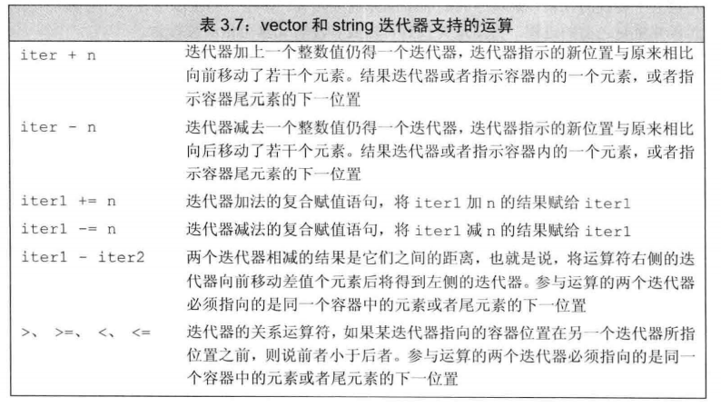
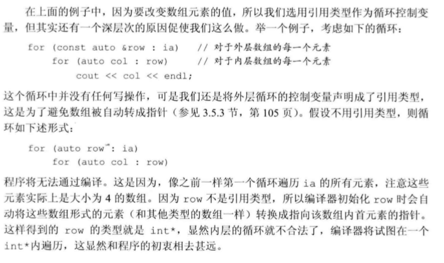

# 字符串、向量和数组

> 这里讲的是 C++中的处理，置于 C 中的字符串向量和数组，可以自己去复习。

## 1 命名空间的 using 声明

### 基本使用

```
//独立使用名字
using namespace::name;
//声明空间
using namespace
```

### 使用规则

头文件中不应包含 using 声明。因为会破坏包含该文件的源文件的命名空间。

## 2 标准库类型 string

### 定义和初始化 string 对象


- 默认初始化
- 直接初始化
- 复制初始化
- 函数初始化

### string 对象上的操作


### 处理 string 对象中的字符

- C++11 新特性的 for 容器遍历。

```C++
    string str("hello world!");
    for(auto c :str){
        cout<<c<<endl;
    }
```

- 使用下标遍历

```
    string s("helo");
    for(int index =0;index != s.size();++index){
        cout<<s[index];
        s[index]=toupper(s[index]);
    }
    cout<<s<<endl;
```

> 三种循环方式：while 条件循环；for 条件循环；for 容器循环。

## 3 标准库类型 vector

### 定义和初始化 vector 对象


- 直接初始化。不适用等号，而是使用{}
- 复制初始化。使用等号，进行初始化
- 函数初始化。使用小括号（），进行初始化，小括号内为参数。
- 列表初始化。使用中括号进行列表初始化。

### 向 vector 对象中添加元素

- 与 C 中初始化数组的方式一样，通过循环对 vector 进行初始化

```
    vector<int> p;
    for(int i=0;i!=100;i++){
        p.push_back(i);
    }
```

### 其他 vector 操作


- 使用下表访问 vector 元素的索引
- 不能使用下标形式向 vector 中添加元素

## 4 迭代器

### 迭代器的使用

```
    vector<int> v{1,2,3,4,5,6,7};
    auto b =v.begin(),e=v.end();

    while(b != e){
        cout<<*b<<endl;
        b++;
    }
```


- 使用特定的函数返回容器对象（集合对象）的迭代器
- 使用解引用操作返回迭代器指针指向的元素

### 迭代器运算



- 两个迭代器相减的结果使他们两个之间的距离，是一个整型常数，返回值不是一个迭代器。所以需要使用 beg+(end-beg)/2 来表示中间 mid 迭代器。end-beg 是一个整数。

```
    // 二分查找实例
    int aim =3;
    vector<int> text ={1,2,3,4,5,6};
    auto beg = text.begin(),end=text.end();
    auto mid = text.begin()+(end-beg)/2;
    while(mid != end && *mid != aim){
        if(aim<*mid){
            end=mid;
        }else{
            beg=mid+1;
        }
        mid =beg+(end-beg)/2;
    }
    cout<<mid-text.begin()<<endl;
```

## 5 数组

### 定义和初始化内置数组

```
int arr[10];//含有10个整型的数组
int *arr[20];//含有20个整形指针的数组。指针数组
int (*ptr)[10];指向含有是个整数的数组的指针。数组的指针（常量的指针和指针类型的常量类似）

string arr[10];//含有10个string对象的数组C++11允许数组为对象类型。
```

### 数组的初始化（仅有两种方法）

```
int arr[3]={1,2,3};
int arr[]={1,2,3,4};
char a3[]="c++"//自动添加表示字符串结束的空字符
```

### 数组的遍历

- C++11 数组也可以使用容器遍历（集合遍历）

```
//下标遍历
    int m[5]={1,2,3,4,5};
   for(int i=0;i<5;i++){
        cout<<m[i]<<endl;
    }
//容器遍历
    int k[] = {1,2,3};
    for (auto l:k){
        cout<<l<<endl;
    }

//迭代器遍历
    int m[5]={1,2,3,4,5};
    int* beg =begin(m);
    int* last = end(m);
    while(beg!=last){
        cout<<*beg<<endl;
        beg++;
    }
```

### 指针和数组

- 数组变量是指向数组第一个元素的指针。

```
string nums[]={"a","b","c"};
string *p2 = &num[0];
string *p3 = num;//相互等价
```

- 数组指针本身也是迭代器。可以使用 begin 函数和 end 函数，实现迭代器遍历。

```
int ia[]={1,2,3};
int *beg = begin(ia);
int *last = end(ia);
```

- 下标访问和指针运算等价

```
int ia[]={1,2,3};
ia[2];
*(ia+2);//相互等价
```

### C 风格的字符串

> 尽量不要使用 C 风格的字符串.C++风格的字符串可以完全替代 C 风格的字符串，并且可以使用字符数组代替 C 风格的字符串。

### 多维数组定义和初始化

* 列表初始化支持只初始化局部元素
```
int ia[2][3]={
    {1,2,3},
    {4,5,6}
};//等价
int ib[2][3]={1,2,3,4,5,6}//等价
```
### 多维数组的引用


```
ia[2][3]
```
### 多维数组的遍历
* 两层for循环处理多维数组
```
int ia[row_cnt][col_cnt]
for(int i=0;i<row_cnt;i++){
    for(int j=0;j<col_cnt;j++){
        ia[i][j];
    }
}
```

* 两层容器遍历，遍历多维数组。

```
    int ia[2][3] = {1, 2, 3, 4, 5, 6};
    //这里使用引用的原因是，数组在传递时候不能直接赋值！！！！
    //如果不加引用将会出现以下情况
    //auto row = ia[0]。但是数组没办法赋值。所以生成数组的一个引用
    //auto &row =ia[0]。相当于生成ia[0]指针的一个别名。
    //书上这么说，外层引用添加的原因，是防止第二层数组被当做指针使用。
    for (auto &row : ia)
    {
        for (auto col : row)
        {
            cout << col << endl;
        }
    }
```
