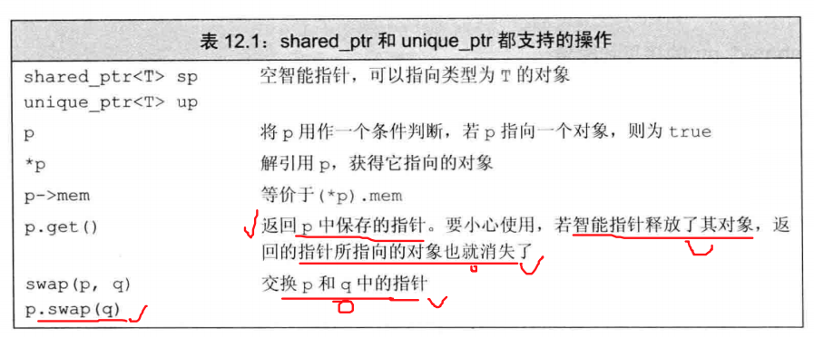
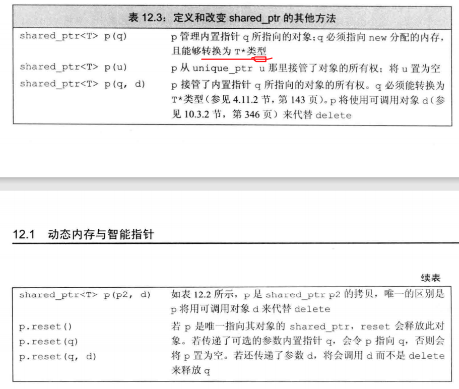
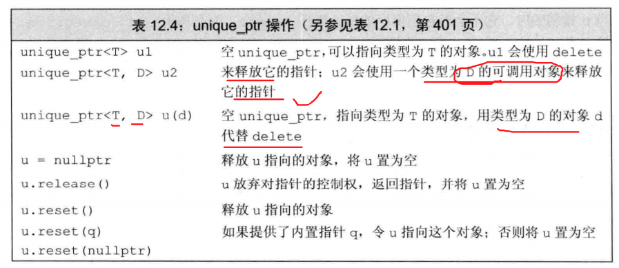
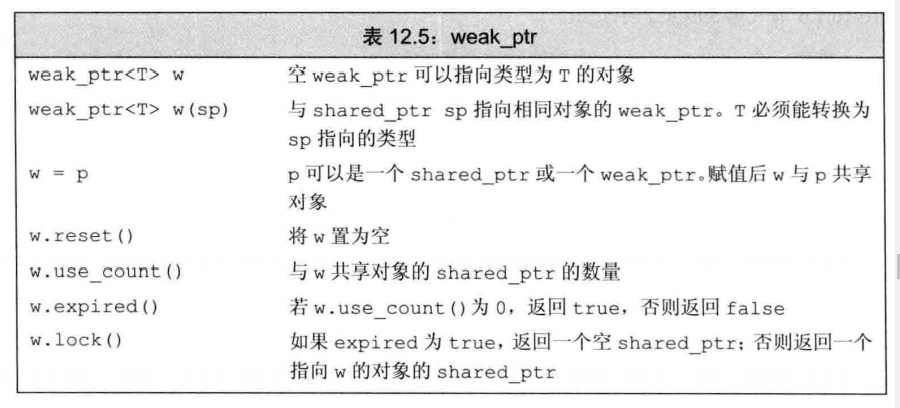
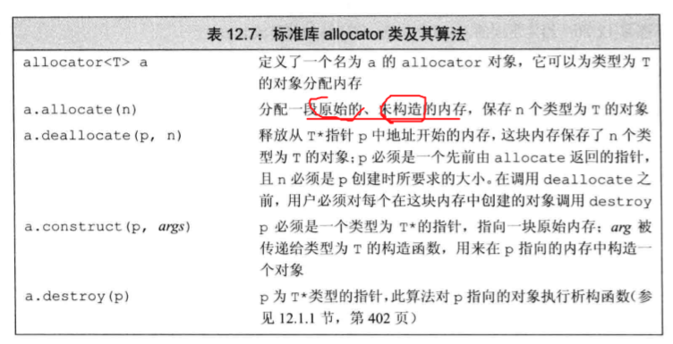

# 动态内存


## 0 C++直接管理内存

### 概念

* C++使用new分配内存，使用delete释放new分配的内存。
* 动态对象的声明周期从创建到被释放时为止。


### 使用动态内存的原因
> 既然这么多风险为什么要使用动态内存
1. 程序不知道自己需要使用给多少对象。动态循环创建多个对象。（容器，包括字符串string，都是使用动态内存管理自身的存储。）
2. 程序不知道所需对象的准确类型。运行过程中创建对象。
3. 程序需要在多个对象间共享数据。多个对象共享相同的状态。


### 申请内存

* new无法围棋分配的对象命名，而是返回一个指向该对象的指针。
```
int * p = new int;
```
* 动态分配的对象执行默认初始化操作。内置类型和组合类型的对象是未定义的。类类型的对象使用默认构造函数进行初始化。

* 可以动态分配const对象
```
const int * pci = new const int(1024);
```
* 内存耗尽后，new表达式会失败。抛出bad_alloc异常。

### 释放内存
* 使用delete来释放内存。将动态内存归还给系统。
* delete指针必须指向动态分配的内存，或一个空指针。
* 释放一块非new分配的内存，或者将相同的指针释放多次，行为是未定义。产生错误。
* delete对象之后，指针指向的地址被释放了，指针无效。但是指针依旧保存着原先的地址。编程**悬空指针**。

> 所有可变长度的容器，都有自己的allcator实现动态内存管理，不需要自己手动申请和释放内存。

## 1 动态内存与智能指针
> 所以智能指针使用过来做动态内存管理的。普通的局部变量及其指针，不需要智能指针。智能指针是辅助new delete来管理动态内存的。智能指针就是为了解决一下问题。


### 两个问题
指针直接管理内存存在两个问题：

1. 没有释放内存，导致内存泄露。
2. 访问已经释放的内存，引起引用非法内存的指针。

### 智能指针

* share_ptr 允许多个指针指向同一对象
* unique_ptr 独占所指向的对象

* weak_ptr伴随类。弱引用。指向shared_ptr所管理的对象。

### 头文件
```
#include<memory>
```
### 智能指针的基础操作



### 智能指针陷阱

> 智能指针本质上不是个指针，是对动态分配的内存的指针的管理，可以通过get函数得到指向动态内存的普通指针。

* 不能使用相同的内置指针初始化多个智能指针
* 不能delete get()返回的普通指针
* 不能用get()返回的指针初始化或reset另一个智能指针。
* 如果使用智能指针管理的资源**不是new分配的内存**，传递给他一个删除器。（new分配的动态内存对应的删除器是delete）

## 2 动态内存管理shared_ptr
### shared_ptr的操作


### make_shared申请内存

* 最安全的使用动态内存的方法，调用make_shared标准库函数。在动态内存中分配一个对象，并初始化。返回shared_ptr.
```
    shared_ptr<int> pn = make_shared<int>(42);
    auto pn = make_shared<int>(42);
```

### shared_ptr拷贝和引用计数

* shared_ptr 都有一个关联的计数器。引用计数。每次copy一个shared_ptr，计数器都会递增。例如将它作为参数传递给一个函数，或者作为函数的返回值。
* 一旦一个shared_ptr的计数器变为0.它就会自动释放自己所管理的内存。使用析构函数，销毁自身。
* 所以当它为局部变量，并且退出局部作用域后，所有的指针变量自动销毁，其所对应的动态分配的内存对象的引用计数就回变为零，此时动态内存会自动销毁。


### shared_ptr和new申请内存
* shared_ptr可以使用make_shared创建对象。也可以使用new返回的指针来初始化智能指针。此时不需要delete来释放。

```
shared_ptr<int> p2(new int(42));
shared_ptr<int> p3 = new int{42};
```
### shared_ptr的其他方法
* shared_ptr的赋值、权限转移和清空。

* 不能试用get初始化另外一个智能指针，也不能用get为智能指针赋值。

* 我们智能使用reset将智能指针指向其他的对象，不能将一个新的对象直接赋值给已经初始化的智能指针。reset函数会更新对象的引用计数，使其指向新的动态内存。

```
shared_ptr<int> = new int;
p = new int(23);//错误，不能直接赋值。
p.reset(new int(1024));//p指向一个新的对象。
```

### 智能指针和异常
* 当触发异常后，局部变量在销毁的时候也会正常出发智能指针的销毁。

## 3 动态内存管理 unique_ptr


* unique_ptr。某个时刻只能有一个unique_ptr只有一个给定的对象。当unique_ptr被销毁时，它所指向的对象也被销毁。
* unique_ptr需要绑定到一个new返回的指针上。直接将指针置为空，指针指向的对象就会被释放。可以使用delete释放unique_ptr
* unique_ptr不支持普通的拷贝和赋值操作。但是可以拷贝或赋值一个将要被销毁的unique_ptr.例如return unique_ptr。实现控制权转移
```
unique_ptr<int> clone(int p){
    return unique_ptr<int>(new int(p));
}//返回了一个动态内存的unique_ptr
```
* 可以release放弃控制权，把控制权移交给新的智能指针。实现动态内存的控制权转移。
```
unique_ptr<int> m=new int;
unique_ptr<int> n = m.release();//m放弃所有权转移给n
```
## 4 动态内存管理weak_ptr
* 不控制所指向对象生存期的智能指针。它指向一个由shared_ptr管理的对象。
* 将weak_ptr绑定到shared_ptr上不会改变shared_ptr的引用计数。当shared_ptr被销毁，对象就回被释放。



* 使用shared_ptr初始化weak_ptr

```
shared_ptr<int> p = make_shared<int>(42);
weak_ptr<int>wp(p);
```
* 由于weak_ptr指向的对象可能不存在，使用lock检查weak_ptr指向的对象是否存在。

```
if(shared_ptr<int>np = wp.lock()){

}
```

### 总结
> 智能指针的操作包括：初始化、解引用、赋值,reset，get。其中赋值操作是一个特例，其他操作都一致：
> * shared_ptr能在两个智能指针之间赋值。reset可以将智能指针指向新的动态内存对象。不能直接将新的动态内存对象赋值给智能指针。
> * unique_ptr不能再两个智能指针之间赋值，但可以在即将销毁的智能指针之间赋值。不能直接将新的动态内存对象赋值给智能指针。reset可以将智能指针指向新的动态内存对象。
> * weak_ptr能将shared_ptr和weak_ptr赋值给weak_ptr;不能将新的动态内存对象赋值给智能指针。reset会将指针置为空。


## 4 动态数组

### 初始化动态内存数组
```
int * pia = new int[10];//默认初始化
int * pia2= new int[10]();//值初始化
int * pia3 = new int[10]{1,2,3,4,54,6,7,8,6,5};
```
* 申请一个大小为0的动态数组是合法的。直接定义一个大小为0的数组是不合法的。

### 释放动态数组

delete [] pa;

### 智能指针和动态数组

* unique_ptr动态数组版本

```
unique_ptr<int[]> up(new int[10]);
up.release();
```


## 5 allocator动态内存

### 简介
* new将动态内存分配和对象构造组合在了一起。也就是说，分配动态内存的时候，必须确定这块内存上的对象。
* allocator能够将内存分配和对象构造分离。
* 在头文件`<memory>`中

### 操作
* 主要操作如下


```
allcator<string> alloc;
auto const p = alloc.allocate(n);//分配n个未初始化的string
auto q = p;
alloc.construct(q++);//*q为空字符串
alloc.construct(q++,10,'c');//*q为cccc
alloc.deallocate(p,n)
```
### allocator算法
* 标准库为allocator定义了两个伴随算法。


