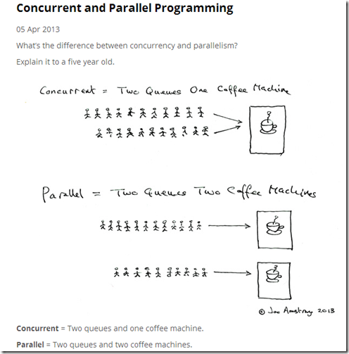
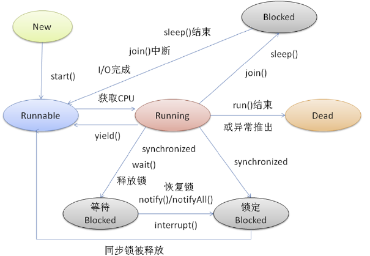
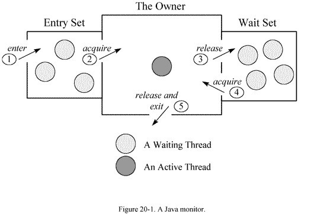
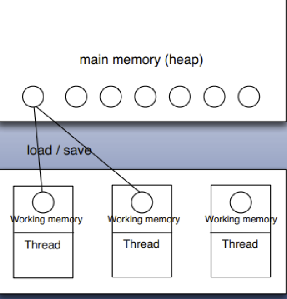
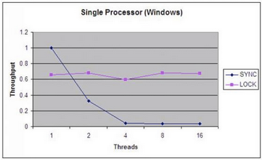

**引**

如果对什么是线程、什么是进程仍存有疑惑，请先Google之，因为这两个概念不在本文的范围之内。

用多线程只有一个目的，那就是更好的利用cpu的资源，因为所有的多线程代码都可以用单线程来实现。说这个话其实只有一半对，因为反应“多角色”的程序代码，最起码每个角色要给他一个线程吧，否则连实际场景都无法模拟，当然也没法说能用单线程来实现：比如最常见的“生产者，消费者模型”。

很多人都对其中的一些概念不够明确，如同步、并发等等，让我们先建立一个数据字典，以免产生误会。

-   多线程：指的是这个程序（一个进程）运行时产生了不止一个线程

-   并行与并发：

    -   并行：多个cpu实例或者多台机器同时执行一段处理逻辑，是真正的同时。

    -   并发：通过cpu调度算法，让用户看上去同时执行，实际上从cpu操作层面不是真正的同时。并发往往在场景中有公用的资源，那么针对这个公用的资源往往产生瓶颈，我们会用TPS或者QPS来反应这个系统的处理能力。

并发与并行

-   线程安全：经常用来描绘一段代码。指在并发的情况之下，该代码经过多线程使用，线程的调度顺序不影响任何结果。这个时候使用多线程，我们只需要关注系统的内存，cpu是不是够用即可。反过来，线程不安全就意味着线程的调度顺序会影响最终结果，如不加事务的转账代码：

void transferMoney(User from, User to, float amount){
to.setMoney(to.getBalance() + amount); from.setMoney(from.getBalance() -
amount); }

-   同步：Java中的同步指的是通过人为的控制和调度，保证共享资源的多线程访问成为线程安全，来保证结果的准确。如上面的代码简单加入@synchronized关键字。在保证结果准确的同时，提高性能，才是优秀的程序。线程安全的优先级高于性能。

好了，让我们开始吧。我准备分成几部分来总结涉及到多线程的内容：

1.  扎好马步：线程的状态

2.  内功心法：每个对象都有的方法（机制）

3.  太祖长拳：基本线程类

4.  九阴真经：高级多线程控制类

**扎好马步：线程的状态**

先来两张图：

线程状态

线程状态转换

各种状态一目了然，值得一提的是"blocked"这个状态：

线程在Running的过程中可能会遇到阻塞(Blocked)情况

1.  调用join()和sleep()方法，sleep()时间结束或被打断，join()中断,IO完成都会回到Runnable状态，等待JVM的调度。

2.  调用wait()，使该线程处于等待池(wait blocked
    pool),直到notify()/notifyAll()，线程被唤醒被放到锁定池(lock blocked pool
    )，释放同步锁使线程回到可运行状态（Runnable）

3.  对Running状态的线程加同步锁(Synchronized)使其进入(lock blocked pool
    ),同步锁被释放进入可运行状态(Runnable)。

此外，在runnable状态的线程是处于被调度的线程，此时的调度顺序是不一定的。Thread类中的yield方法可以让一个running状态的线程转入runnable。

**内功心法：每个对象都有的方法（机制）**

synchronized, wait, notify 是任何对象都具有的同步工具。让我们先来了解他们

monitor

他们是应用于同步问题的人工线程调度工具。讲其本质，首先就要明确monitor的概念，Java中的每个对象都有一个监视器，来监测并发代码的重入。在非多线程编码时该监视器不发挥作用，反之如果在synchronized
范围内，监视器发挥作用。

wait/notify必须存在于synchronized块中。并且，这三个关键字针对的是同一个监视器（某对象的监视器）。这意味着wait之后，其他线程可以进入同步块执行。

当某代码并不持有监视器的使用权时（如图中5的状态，即脱离同步块）去wait或notify，会抛出java.lang.IllegalMonitorStateException。也包括在synchronized块中去调用另一个对象的wait/notify，因为不同对象的监视器不同，同样会抛出此异常。

再讲用法：

-   synchronized单独使用：

    -   代码块：如下，在多线程环境下，synchronized块中的方法获取了lock实例的monitor，如果实例相同，那么只有一个线程能执行该块内容

复制代码

public class Thread1 implements Runnable { Object lock; public void run() {
synchronized(lock){ ..do something } } }

复制代码

-   直接用于方法：
    相当于上面代码中用lock来锁定的效果，实际获取的是Thread1类的monitor。更进一步，如果修饰的是static方法，则锁定该类所有实例。

public class Thread1 implements Runnable { public synchronized void run() { ..do
something } }

-   synchronized, wait, notify结合:典型场景生产者消费者问题

复制代码

/\*\* \* 生产者生产出来的产品交给店员 \*/ public synchronized void produce() {
if(this.product \>= MAX_PRODUCT) { try { wait();
System.out.println("产品已满,请稍候再生产"); } catch(InterruptedException e) {
e.printStackTrace(); } return; } this.product++;
System.out.println("生产者生产第" + this.product + "个产品."); notifyAll();
//通知等待区的消费者可以取出产品了 } /\*\* \* 消费者从店员取产品 \*/ public
synchronized void consume() { if(this.product \<= MIN_PRODUCT) { try { wait();
System.out.println("缺货,稍候再取"); } catch (InterruptedException e) {
e.printStackTrace(); } return; } System.out.println("消费者取走了第" +
this.product + "个产品."); this.product--; notifyAll();
//通知等待去的生产者可以生产产品了}

复制代码

**volatile**

多线程的内存模型：main memory（主存）、working
memory（线程栈），在处理数据时，线程会把值从主存load到本地栈，完成操作后再save回去(volatile关键词的作用：每次针对该变量的操作都激发一次load
and save)。

volatile

针对多线程使用的变量如果不是volatile或者final修饰的，很有可能产生不可预知的结果（另一个线程修改了这个值，但是之后在某线程看到的是修改之前的值）。其实道理上讲同一实例的同一属性本身只有一个副本。但是多线程是会缓存值的，本质上，volatile就是不去缓存，直接取值。在线程安全的情况下加volatile会牺牲性能。

**太祖长拳：基本线程类**

基本线程类指的是Thread类，Runnable接口，Callable接口

Thread 类实现了Runnable接口，启动一个线程的方法：

MyThread my = new MyThread(); my.start();

**Thread类相关方法：**

复制代码

//当前线程可转让cpu控制权，让别的就绪状态线程运行（切换）public static
Thread.yield() //暂停一段时间public static Thread.sleep()
//在一个线程中调用other.join(),将等待other执行完后才继续本线程。 public join()
//后两个函数皆可以被打断public interrupte()

复制代码

**关于中断**：它并不像stop方法那样会中断一个正在运行的线程。线程会不时地检测中断标识位，以判断线程是否应该被中断（中断标识值是否为true）。终端只会影响到wait状态、sleep状态和join状态。被打断的线程会抛出InterruptedException。

Thread.interrupted()检查当前线程是否发生中断，返回boolean

synchronized在获锁的过程中是不能被中断的。

中断是一个状态！interrupt()方法只是将这个状态置为true而已。所以说正常运行的程序不去检测状态，就不会终止，而wait等阻塞方法会去检查并抛出异常。如果在正常运行的程序中添加while(!Thread.interrupted())
，则同样可以在中断后离开代码体

**Thread类最佳实践**：

写的时候最好要设置线程名称 Thread.name，并设置线程组
ThreadGroup，目的是方便管理。在出现问题的时候，打印线程栈 (jstack -pid)
一眼就可以看出是哪个线程出的问题，这个线程是干什么的。

**如何获取线程中的异常**

不能用try,catch来获取线程中的异常

**Runnable**

与Thread类似

**Callable**

future模式：并发模式的一种，可以有两种形式，即无阻塞和阻塞，分别是isDone和get。其中Future对象用来存放该线程的返回值以及状态

ExecutorService e = Executors.newFixedThreadPool(3);
//submit方法有多重参数版本，及支持callable也能够支持runnable接口类型.Future
future = e.submit(new myCallable()); future.isDone() //return true,false 无阻塞
future.get() // return 返回值，阻塞直到该线程运行结束

**九阴真经：高级多线程控制类**

以上都属于内功心法，接下来是实际项目中常用到的工具了，Java1.5提供了一个非常高效实用的多线程包:*java.util.concurrent*,
提供了大量高级工具,可以帮助开发者编写高效、易维护、结构清晰的Java多线程程序。

**1.ThreadLocal类**

用处：保存线程的独立变量。对一个线程类（继承自Thread)

当使用ThreadLocal维护变量时，ThreadLocal为每个使用该变量的线程提供独立的变量副本，所以每一个线程都可以独立地改变自己的副本，而不会影响其它线程所对应的副本。常用于用户登录控制，如记录session信息。

实现：每个Thread都持有一个TreadLocalMap类型的变量（该类是一个轻量级的Map，功能与map一样，区别是桶里放的是entry而不是entry的链表。功能还是一个map。）以本身为key，以目标为value。

主要方法是get()和set(T a)，set之后在map里维护一个threadLocal -\>
a，get时将a返回。ThreadLocal是一个特殊的容器。

**2.原子类（AtomicInteger、AtomicBoolean……）**

如果使用atomic wrapper
class如atomicInteger，或者使用自己保证原子的操作，则等同于synchronized

//返回值为booleanAtomicInteger.compareAndSet(int expect,int update)

该方法可用于实现乐观锁，考虑文中最初提到的如下场景：a给b付款10元，a扣了10元，b要加10元。此时c给b2元，但是b的加十元代码约为：

复制代码

if(b.value.compareAndSet(old, value)){ return ; }else{ //try again // if that
fails, rollback and log}

复制代码

**AtomicReference**

对于AtomicReference 来讲，也许对象会出现，属性丢失的情况，即oldObject ==
current，但是oldObject.getPropertyA != current.getPropertyA。

这时候，AtomicStampedReference就派上用场了。这也是一个很常用的思路，即加上版本号

**3.Lock类**

lock: 在java.util.concurrent包内。共有三个实现：

ReentrantLock ReentrantReadWriteLock.ReadLock ReentrantReadWriteLock.WriteLock

主要目的是和synchronized一样，
两者都是为了解决同步问题，处理资源争端而产生的技术。功能类似但有一些区别。

区别如下：

复制代码

lock更灵活，可以自由定义多把锁的枷锁解锁顺序（synchronized要按照先加的后解顺序）
提供多种加锁方案，lock 阻塞式, trylock 无阻塞式, lockInterruptily 可打断式，
还有trylock的带超时时间版本。 本质上和监视器锁（即synchronized是一样的）
能力越大，责任越大，必须控制好加锁和解锁，否则会导致灾难。 和Condition类的结合。
性能更高，对比如下图：

复制代码

synchronized和Lock性能对比

**ReentrantLock**

可重入的意义在于持有锁的线程可以继续持有，并且要释放对等的次数后才真正释放该锁。

使用方法是：

1.先new一个实例

static ReentrantLock r=new ReentrantLock();

2.加锁

r.lock()或r.lockInterruptibly();

此处也是个不同，后者可被打断。当a线程lock后，b线程阻塞，此时如果是lockInterruptibly，那么在调用b.interrupt()之后，b线程退出阻塞，并放弃对资源的争抢，进入catch块。（如果使用后者，必须throw
interruptable exception 或catch）

3.释放锁

r.unlock()

必须做！何为必须做呢，要放在finally里面。以防止异常跳出了正常流程，导致灾难。这里补充一个小知识点，finally是可以信任的：经过测试，哪怕是发生了OutofMemoryError，finally块中的语句执行也能够得到保证。

**ReentrantReadWriteLock**

可重入读写锁（读写锁的一个实现）

ReentrantReadWriteLock lock = new ReentrantReadWriteLock() ReadLock r =
lock.readLock(); WriteLock w = lock.writeLock();

两者都有lock,unlock方法。写写，写读互斥；读读不互斥。可以实现并发读的高效线程安全代码

**4.容器类**

这里就讨论比较常用的两个：

BlockingQueue ConcurrentHashMap

**BlockingQueue**

阻塞队列。该类是java.util.concurrent包下的重要类，通过对Queue的学习可以得知，这个queue是单向队列，可以在队列头添加元素和在队尾删除或取出元素。类似于一个管
道，特别适用于先进先出策略的一些应用场景。普通的queue接口主要实现有PriorityQueue（优先队列），有兴趣可以研究

BlockingQueue在队列的基础上添加了多线程协作的功能：

BlockingQueue

除了传统的queue功能（表格左边的两列）之外，还提供了阻塞接口put和take，带超时功能的阻塞接口offer和poll。put会在队列满的时候阻塞，直到有空间时被唤醒；take在队
列空的时候阻塞，直到有东西拿的时候才被唤醒。用于生产者-消费者模型尤其好用，堪称神器。

常见的阻塞队列有：

ArrayListBlockingQueue LinkedListBlockingQueue DelayQueue SynchronousQueue

**ConcurrentHashMap**

高效的线程安全哈希map。请对比hashTable , concurrentHashMap, HashMap

**5.管理类**

管理类的概念比较泛，用于管理线程，本身不是多线程的，但提供了一些机制来利用上述的工具做一些封装。

了解到的值得一提的管理类：ThreadPoolExecutor和 JMX框架下的系统级管理类
ThreadMXBean

**ThreadPoolExecutor**

如果不了解这个类，应该了解前面提到的ExecutorService，开一个自己的线程池非常方便：

复制代码

ExecutorService e = Executors.newCachedThreadPool(); ExecutorService e =
Executors.newSingleThreadExecutor(); ExecutorService e =
Executors.newFixedThreadPool(3); //
第一种是可变大小线程池，按照任务数来分配线程， //
第二种是单线程池，相当于FixedThreadPool(1) // 第三种是固定大小线程池。 //
然后运行e.execute(new MyRunnableImpl());

复制代码

该类内部是通过ThreadPoolExecutor实现的，掌握该类有助于理解线程池的管理，本质上，他们都是ThreadPoolExecutor类的各种实现版本。请参见javadoc：

ThreadPoolExecutor参数解释

翻译一下：

复制代码

corePoolSize:池内线程初始值与最小值，就算是空闲状态，也会保持该数量线程。
maximumPoolSize:线程最大值，线程的增长始终不会超过该值。
keepAliveTime：当池内线程数高于corePoolSize时，经过多少时间多余的空闲线程才会被回收。回收前处于wait状态
unit： 时间单位，可以使用TimeUnit的实例，如TimeUnit.MILLISECONDS
workQueue:待入任务（Runnable）的等待场所，该参数主要影响调度策略，如公平与否，是否产生饿死(starving)
threadFactory:线程工厂类，有默认实现，如果有自定义的需要则需要自己实现ThreadFactory接口并作为参数传入。
