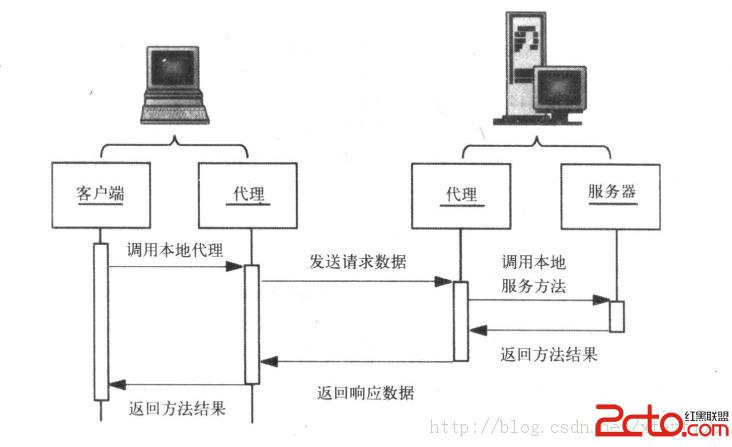
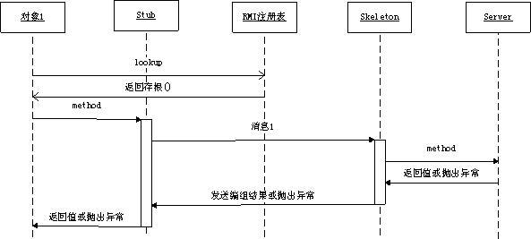

RMI的定义

RPC (Remote Procedure
Call):远程方法调用，用于一个进程调用另一个进程中的过程，从而提供了过程的分布能力。

RMI（Remote Method
Invocation):远程方法调用，即在RPC的基础上有向前迈进了一步，提供分布式对象间的通讯。允许运行在一个java
虚拟机的对象调用运行在另一个java虚拟机上对象的方法。这两个虚拟机可以是运行在相同计算机上的不同进程中，也可以是运行在网络上的不同计算机中。

RMI的作用

RMI的全称宗旨就是尽量简化远程接口对象的调用。

RMI大大增强了java开发分布式应用的能力，例如可以将计算方法复杂的程序放在其他的服务器上，主服务器只需要去调用，而真正的运算是在其他服务器上进行，最后将运算结果返回给主服务器，这样就减轻了主服务器的负担，提高了效率（但是也有其他的开销）。

RMI网络模型

在设计初始阶段，我们真正想要的是这样一种机制，客户端程序员以常规方式进行方法调用，而无需操心将数据发送到网络上或者解析响应之类的问题。所以才有了如下的网络模型：在客户端为远程对象安装一个代理。代理是位于客户端虚拟机中的一个对象，它对于客户端程序来说，就像是要访问的远程对象一样。客户端调用此代理时，只需进行常规的方法调用。而客户端代理则负责使用网络协议与服务器进行联系。

现在的问题在于代理之间是如何进行通信的？通常有三种方法：

1、CORBA：通过对象请求代理架构，支持任何编程语言编写的对象之间的方法调用。

2、SOAP

3、RMI：JAVA的远程方法调用技术，支持java的分布式对象之间的方法调用。

其中CORBA与SOAP都是完全独立于言语的，可以使用C、C++、JAVA来编写，而RMI只适用于JAVA。

RMI的工作原理

**术语介绍**

>   1、存根：当客户端要调用远程对象的一个方法时，实际上调用的是代理对象上的一个普通方法，**我们称此代理对象为存根（stub）。**存根位于客户端机器上，而非服务器上。

>   2、参数编组：存根会将**远程方法所需的参数打包成一组字节**，对参数编码的过程就称为参数编组。参数编组的目的是将参数转换成适合在虚拟机之间进行传递的格式，在RMI协议中，对象是使用序列化机制进行编码的。

编程模型

为了介绍RMI的编程模型，我下面会编写一个DEMO。远程对象表示的是一个仓库，而客户端程序向仓库询问某个产品的价格。

**接口定义**

远程对象的能力是由在客户端和服务器之间共享的接口所表示的：

复制代码

package rmi; import java.rmi.Remote; import java.rmi.RemoteException; public
interface Warehouse extends Remote { double getPrice(String description) throws
RemoteException; }

远程对象的接口必须扩展Remote接口，它位于java.rmi包中。接口中所有的方法必须声明抛出RemoteException异常。这是因为远程方法总是存在失败的可能，所以java编程语言要求每一次远程方法的调用都必须捕获RemoteException,并且指明当调用不成功时应执行的相应处理操作。

**接口的实现**

复制代码

package rmi; import java.rmi.RemoteException; import
java.rmi.server.UnicastRemoteObject; import java.util.HashMap; import
java.util.Map; public class WarehouseImpl extends UnicastRemoteObject implements
Warehouse { private static final long serialVersionUID = 1L; private
Map\<String,Double\> prices; protected WarehouseImpl() throws RemoteException {
prices = new HashMap\<String,Double\>(); prices.put("mate7",3700.00); } public
double getPrice(String description) throws RemoteException { Double price =
prices.get(description); return price == null? 0 : price; }}

你可以看出这个类是远程方法调用的目标，因为它扩展自UnicastRemoteObject，这个类的构造器使得它的对象可供远程访问。

**RMI注册表:通过JNDI发布RMI服务**

1、要访问服务器上的一个远程对象时，客户端必须先得到一个本地的存根对象，也就是客户端机器上的代理对象。那么问题来了，如何才能得到这个存根呢？

2、为此，JDK提供了自举注册服务（bootstrap registry
service），服务器程序应该使用自举注册服务来注册至少一个远程对象。

3、而要注册一个远程对象，需要一个RMI URL和一个对实现对象的引用。

4、RMI
的URL以rmi:开头，后接域名或IP地址（host），紧接着是端口号（port），最后是服务名（service）。

如：rmi://regserver.mycompany.cmo:99/central_warehouse

如果我们是在本地发布RMI服务，那么host就是“localhost”，此外RMI默认的端口号是“1099”，当然我们也可以自行设置，只要不与其他端口重复即可。service实际上是基于同一个host与port下唯一的服务名。

发布RMI服务：

1 package rmi; 2 3 import java.net.MalformedURLException; 4 import
java.rmi.AlreadyBoundException; 5 import java.rmi.Naming; 6 import
java.rmi.RemoteException; 7 import java.rmi.registry.LocateRegistry; 8 9 import
javax.naming.NamingException; 10 11 12 public class WarehouseServer 13 { 14
public static void main(String[] args) throws RemoteException, NamingException,
MalformedURLException, AlreadyBoundException 15 { 16
System.out.println("Constructing server implementation"); 17 WarehouseImpl
centralWarehouse = new WarehouseImpl(); 18 19 System.out.println("Binding server
implementation to registry"); 20 LocateRegistry.createRegistry(1099); 21
Naming.bind("rmi://localhost:1099/central_warehoues",centralWarehouse); 22 23
System.out.println("Waiting for invocations from clients ..."); 24 } 25 }

运行结果：

Constructing server implementation Binding server implementation to registry
Waiting for invocations from clients ...

1、第20行只需提供一个port，就在JNDI中创建了一个注册表。

2、第21行通过bind方法绑定了RMI地址与RMI服务实现类。

3、执行这个方法后，相当于自动发布了RMI服务。接下来要做的事情就是写一个RM客户端调用已发布的RMI服务。

**客户端调用RMI服务**

1 package rmi; 2 3 import java.net.MalformedURLException; 4 import
java.rmi.Naming; 5 import java.rmi.NotBoundException; 6 import
java.rmi.RemoteException; 7 import javax.naming.NamingException; 8 9 public
class WarehouseClient 10 { 11 public static void main(String[] args) throws
NamingException, RemoteException, MalformedURLException, NotBoundException 12 {
13 System.out.println("RMI registry binding:"); 14 String url =
"rmi://localhost:1099/central_warehoues"; 15 Warehouse centralWarehouse =
(Warehouse) Naming.lookup(url); 16 String descr = "mate7"; 17 double price =
centralWarehouse.getPrice(descr); 18 System.out.println(descr + ":" + price); 19
} 20 }

运行结果：

RMI registry binding: mate7:3700.0

补充说明：

>   服务调用只需要知道两个东西：1、RMI请求路径；2、RMI接口名

>   第15行，这里用的是接口名Warehouse,而不是实现类。一定不能RMI接口的实现类，否则就是本地调用了。

>   查看运行结果，我们知道这次DEMO展示的远程调用成功了。

**下面我们来看下RMI的网络示意图：**

1、借助JNDI这个所谓的命名与目录服务，我们成功地发布并调用了RMI服务。实际上，JNDI就是一个注册表，服务端将服务对象放入到注册表中，客户端从注册表中获取服务对象。

2、在服务端我们发布了RMI服务，并在JNDI中进行了注册，此时就在服务端创建了一个Skeleton（骨架），当客户端第一次成功连接JNDI并获取远程服务对象后，立马在本地创建了一个Stub（存根）。

3、远程通信实际是通过Skeleton与Stub来完成的，数据是基于TCP/IP协议，在“传输层”上发送的。

4、毋庸置疑，理论上RMI一定比WebService要快，毕竟WebService是基于http协议的，而http所携带的数据是通过“应用层”来传输的。传输层较应用层更为底层，越底层越快。

RMI的局限性

1、只能实现JAVA系统之间的调用，而WebService可以实现跨语言实现系统之间的调用。

2、RMI使用了JAVA默认的序列化方式，对于性能要求比较高的系统，可能需要其他的序列化方案来解决。

3、RMI服务在运行时难免会存在故障，例如，如果RMI服务无法连接了，就会导致客户端无法响应的现象。
