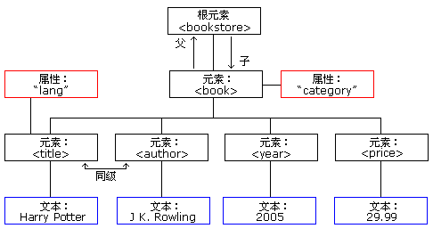

简介

**作用：**

用来传输和存储数据

**定义：**

可扩展标记语言。

**特点：**

自行定义标签，具有自我描述性。

能够跨越各种平台

**具体应用：**

用于描述可用的web服务的WSDL

树结构

**范例**

\<?xml version="1.0"
encoding="UTF-8"?\>\<note\>\<to\>Tove\</to\>\<from\>Jani\</from\>\<heading\>Reminder\</heading\>\<body\>Don't
forget me this weekend!\</body\>\</note\>

说明：第一行是XML文档声明，定义了版本号和文档的编码方式。

**树结构：**

**元素：**

起始标记、结束标记、内容（可以是字符文本、其他元素、混合物）

**属性：**

属性名=属性值

**语法规则：**

标签闭合，正确嵌套

有一个根元素

可以有树枝也可以由实体引用

XML声明可选，放在第一行

XML标签对大小写敏感

属性值必须加引号，应当尽量用子元素代替属性。数据的数据存储为属性，而数据本身应当存储为元素。

id属性可以用来标识XML元素

注释方式\<!-- This is a comment --\>

部分字符使用转义字符

| &lt;    | \< | less than      |
|---------|----|----------------|
| &gt;    | \> | greater than   |
| \&amp;  | &  | ampersand      |
| \&apos; | '  | apostrophe     |
| &quot;  | "  | quotation mark |

命名空间

**名字冲突**

同时使用相同的名字

**限定名字**

使用名字空间。在标签之前加上前缀

>   \<h:table xmlns:h="http://www.w3.org/TR/html4/"\> \<h:tr\>
>   \<h:td\>Apples\</h:td\> \<h:td\>Bananas\</h:td\> \</h:tr\> \</h:table\>

使用默认的名字空间

>   \<table xmlns="http://www.w3.org/TR/html4/"\> \<tr\> \<td\>Apples\</td\>
>   \<td\>Bananas\</td\> \</tr\> \</table\>

XML定义方式

**XML DTD**

DTD 的目的是定义 XML 文档的结构。它使用一系列合法的元素来定义文档结构：

>   \<!DOCTYPE note

>   [

>   \<!ELEMENT note (to,from,heading,body)\>

>   \<!ELEMENT to (\#PCDATA)\>

>   \<!ELEMENT from (\#PCDATA)\>

>   \<!ELEMENT heading (\#PCDATA)\>

>   \<!ELEMENT body (\#PCDATA)\>

>   ]\>

**XML Schema**

W3C 支持一种基于 XML 的 DTD 代替者，它名为 XML Schema：

>   \<xs:element name="note"\>

>   \<xs:complexType\>

>   \<xs:sequence\>

>   \<xs:element name="to" type="xs:string"/\>

>   \<xs:element name="from" type="xs:string"/\>

>   \<xs:element name="heading" type="xs:string"/\>

>   \<xs:element name="body" type="xs:string"/\>

>   \</xs:sequence\>

>   \</xs:complexType\>

>   \</xs:element\>

XML验证方式

对xml语法进行检查

XML显示方式

**源代码**

**CSS格式显示**

>   CATALOG { background-color: \#ffffff; width: 100%; } CD { display: block;
>   margin-bottom: 30pt; margin-left: 0; } TITLE { color: \#FF0000; font-size:
>   20pt; } ARTIST { color: \#0000FF; font-size: 20pt; }
>   COUNTRY,PRICE,YEAR,COMPANY { display: block; color: \#000000; margin-left:
>   20pt; }

**XSLT格式显示XML**

将XML转化为对应的HTML语言

>   \<?xml version="1.0" encoding="ISO-8859-1"?\>

>   \<!-- Edited by XMLSpy® --\>

>   \<html xsl:version="1.0" xmlns:xsl="http://www.w3.org/1999/XSL/Transform"
>   xmlns="http://www.w3.org/1999/xhtml"\>

>   \<body style="font-family:Arial;font-size:12pt;background-color:\#EEEEEE"\>

>   \<xsl:for-each select="breakfast_menu/food"\>

>   \

>   \\<xsl:value-of select="name"/\>\</span\>

>   \- \<xsl:value-of select="price"/\>

>   \</div\>

>   \

>   \<p\>\<xsl:value-of select="description"/\>.

>   \

>   \<xsl:value-of select="calories"/\> (calories per serving)

>   \</span\>.\</p\>

>   \</div\>

>   \</xsl:for-each\>

>   \</body\>

>   \</html\>
