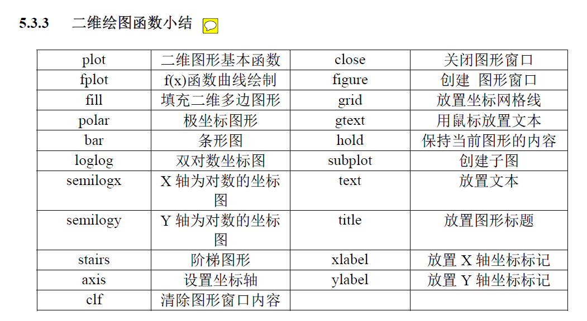
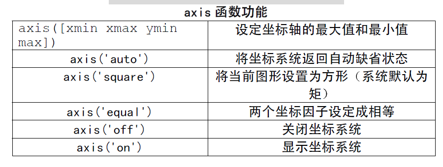
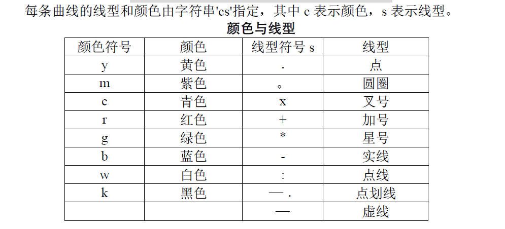

**MATLAB中的绘图功能**

**\>二维高层绘图的基本函数**

-   **plot函数**

    1.  plot(x,y);

    2.  x和y为相同长度的向量

    3.  如果plot为单个参数，绘制折现图，横坐标为自然数。如果参数为复数，则实轴和虚轴进行绘制。（可以绘制圆）

    4.  如果绘制过程中，自变量为向量，因变量为矩阵，则对矩阵的每一个列向量，绘制一个关于自变量的图像。也就是说，如果想要在同一图中绘制函数，不需要写多个plot，只需要将因变量转换为矩阵就好。

    5.  如果绘制过程中，自变量和因变量同为高阶矩阵，则会为x的每一列为自变量，y的每一列为因变量，绘图。

    6.  注意行向量的能够组合成行向量矩阵，列项量能组合成列项量矩阵。

    7.  linespace()和冒号表达式均可以产生行向量

**\>二维高层绘图辅助操作**

-   涉及到的函数、控制或者命令

这里有一张图片

-   标注

    -   坐标轴控制

这里有一张图片

-   图形名称

    -   曲线名称

    -   图例

-   图形保持

-   窗口分割

这里有一张图片

-   可以使用latex字符进行控制

-   xlim([xmin,xmax])

-   ylim([ymin,ymax])

-   axis([xmin,xmax,ymin,ymax])
