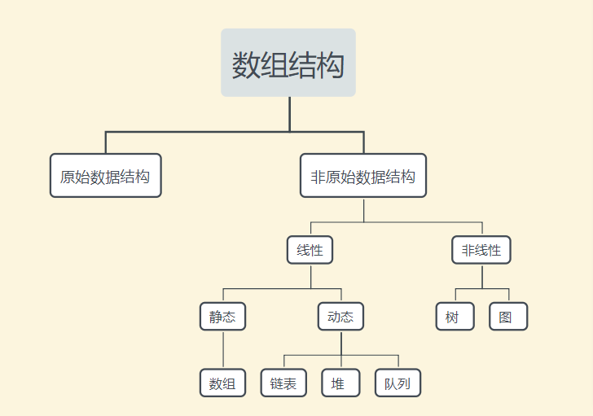

## 数据结构基础

> 参考文献
> * [易佰教程](https://www.yiibai.com/data_structure)

## 1 简介
### 数据结构的组成

* 数据结构主要包括两部分。
  * **数据的结构**。包括存储结构和逻辑结构。存储结构决定在其在计算机内存中的表现形式和具有的特点。逻辑结构决定了“数据”内部之间的关联结构。
  * **数据的规则**。基于数据的存储结构和逻辑结构。衍生出数据的一系列基本操作。包括创建、遍历、插入、删除等，每一类数据结构都有其相应的基础操作。

* 本目录主要讲解了。数据的结构和数据的规则。以及这两个东西的实现方法。不包括在这些数据的和数据的规则之上的更顶层的算法。如基于前序遍历（数据的规则）的什么什么算法（上层的算法）。


### 数据结构预算法


###  基本术语

数据结构是任何程序或软件的构建块(基础块)。为程序选择适当的数据结构对于程序员来说是最困难的任务。就数据结构而言，使用以下术语 - 
* 数据：数据可以定义为基本值或值集合，例如，学生的姓名和ID，成绩等就是学生的数据。
* 组项：具有从属数据项的数据项称为组项，例如，学生的姓名由名字和姓氏组成。
* 记录：记录可以定义为各种数据项的集合，例如，如果以学生实体为例，那么学生的名称，地址，课程和标记可以组合在一起形成学生的记录。
* 文件：文件是一种类型实体的各种记录的集合，例如，如果类中有60名员工，则相关文件中将有20条记录，其中每条记录包含有关每个员工的数据。
* 属性和实体：实体表示某些对象的类。它包含各种属性。每个属性表示该实体的特定属性。
* 字段：字段是表示实体属性的单个基本信息单元。

### 为什么需要数据结构

随着应用程序变得越来越复杂，数据量日益增加，可能会出现以下问题：

* 处理器速度：要处理非常大的数据，需要高速处理，但随着数据逐日增长到每个实体数十亿个文件，处理器可能无法处理大量数据。
* 数据搜索：假设商店的库存大小是100860个商品，如果应用程序需要搜索某一特定商品，则每次需要遍历100860个商品，这会导致搜索过程变慢。
* 大量请求：如果成千上万的用户在Web服务器上同时搜索数据，在此过程中可能在短时会有一个非常大请求而导致服务器处理不了。

### 数据结构的优点

* 效率：程序的效率取决于数据结构的选择。 
* 可重用性：数据结构是可重用的，即当实现了特定的数据结构，就可以在其他地方使用它。也将数据结构的实现编译到不同客户端使用的程序库中
* 抽象：数据结构由ADT指定，它提供抽象级别。 客户端程序仅通过接口使用数据结构，而不涉及实现细节。


## 2 数据结构分类




### 线性数据结构

如果数据结构的所有元素按线性顺序排列，则称为线性数据结构。 在线性数据结构中，元素以非分层方式存储，除了第一个和最后一个元素，它的每个元素具有后继元素和前导元素。
线性数据结构的类型如下：

* 数组：数组是类似数据项的集合，每个数据项称为数组的元素。 元素的数据类型可以是任何有效的数据类型，如char，int，float或double。数组的元素共享相同的变量名，但每个元素都带有一个不同的索引号，这些索引号也称为下标。 数组可以是一维的，二维的或多维的。
```
age[0], age[1], age[2], age[3],.... age[98], age[99]
```

* 链表：链表是一种线性数据结构，用于维护内存中的列表。 它可以看作存储在非连续内存位置的节点集合。链表中的每个节点都包含指向其相邻节点的指针。
* 堆栈 ：堆栈是一个线性列表，其中只允许在一端插入和删除，称为顶部。堆栈是一种抽象数据类型(ADT)，可以在大多数编程语言中实现。 它被命名为堆栈，因为它的行为类似于真实世界的堆栈，例如：成堆的板块或卡片组等，只能在最顶面上操作。
* 队列：队列是一个线性列表，它的元素只能在一端插入(添加)，也被称为后端，而只在另一端出队(删除)，也被称为前端。

### 非线性数据结构

非线性数据结构不形成序列，即每个项目或元素以非线性排列与两个或更多个其他项目连接。 数据元素不按顺序结构排列。
非线性数据结构的类型如下：

* 树：树是多级数据结构，其元素之间具有层次关系，树的元素也称为节点。层次中最底层的节点称为叶节点，而最顶层节点称为根节点。 每个节点都包含指向相邻节点的指针。树数据结构基于节点之间的父子关系。 除了叶节点之外，树中的每个节点可以具有多个子节点，而除了根节点之外，每个节点可以具有最多一个父节点。 树可以分为许多类别，本教程在稍后章节中将对此进行讨论。
* 图：图可以定义为由称为边缘的链接连接的元素集(由顶点表示)的图表示。 图不同于树，图可以有循环而树不能具有循环。


## 3 数据结构的操作

> 从数据结构的角度

* **遍历**：每个数据结构都包含一组数据元素。遍历数据结构表示访问数据结构的每个元素，以便执行某些特定操作，如搜索或排序。示例 ：如果需要计算学生在6个不同科目中获得的分数的平均值，需要遍历完整的分数数组并计算总和，然后将总分数除以科目数，即6， 最后得到平均值。
* **插入**：插入是在任何位置将元素添加到数据结构的过程。如果数据结构的大小是n，那么只能在n-1个数据元素之间插入元素。
* **删除**：从数据结构中删除元素的过程称为删除。 可以在任何随机位置删除数据结构中的元素。如果要从空数据结构中删除元素，则会发生下溢。
* **搜索**：在数据结构中查找元素位置的过程称为搜索。 有两种算法可以执行搜索，即线性搜索和二进制搜索。在本教程后面讨论这两种搜索算法。
* **排序**：按特定顺序排列数据结构的过程称为排序。 有许多算法可用于执行排序，例如，插入排序，选择排序，冒泡排序等。
* **更新**：为更新数据结构中的现有元素而开发的算法。
* **合并**：当两个列表分别为大小为M和N的列表A和列表B时，相似类型的元素，连接产生第三个列表，列表C的大小(M + N)，则此过程称为合并。


