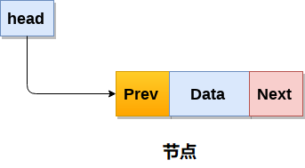

# 双链表

## 1 双链表的简介
### 概念

* 双向链表是一种复杂类型的链表，它的节点包含指向序列中前一个节点和下一个节点的指针。
* 在双向链表中，节点由三部分组成：节点数据，指向下一个节点的指针(next指针)，指向前一个节点的指针(prev指针)。




## 2 双链表的存储和实现

### 数据存储
* 双向链表为每个节点消耗更多空间
* 可以更灵活地操作链表中的元素。


### 数据实现
* 使用结构体和指针实现。
```C
struct node   
{  
    struct node *prev;   
    int data;  
    struct node *next;   
}
```
* 使用STL中的list实现

```
#include<list>
list<int> li;
```
## 3 双链表的操作
### 基本操作
* 创建
* 遍历、搜索
* 插入
* 删除


### 实现
```C++
#include<stdio.h>  
#include<stdlib.h>  
struct node
{
    struct node *prev;
    struct node *next;
    int data;
};
struct node *head;
void insertion_beginning();
void insertion_last();
void insertion_specified();
void deletion_beginning();
void deletion_last();
void deletion_specified();
void display();
void search();
void main()
{
    int choice = 0;
    while (choice != 9)
    {
        printf("*********Main Menu*********\n");
        printf("Choose one option from the following list ...\n");
        printf("===============================================\n");
        printf("1.Insert in begining\n2.Insert at last\n3.Insert at any random location\n4.Delete from Beginning\n5.Delete from last\n6.Delete the node after the given data\n7.Search\n8.Show\n9.Exit\n");  
            printf("Enter your choice?\n");
        scanf("%d", &choice);
        switch (choice)
        {
        case 1:
            insertion_beginning();
            break;
        case 2:
            insertion_last();
            break;
        case 3:
            insertion_specified();
            break;
        case 4:
            deletion_beginning();
            break;
        case 5:
            deletion_last();
            break;
        case 6:
            deletion_specified();
            break;
        case 7:
            search();
            break;
        case 8:
            display();
            break;
        case 9:
            exit(0);
            break;
        default:
            printf("Please enter valid choice..");
        }
    }
}
void insertion_beginning()
{
    struct node *ptr;
    int item;
    ptr = (struct node *)malloc(sizeof(struct node));
    if (ptr == NULL)
    {
        printf("OVERFLOW\n");
    }
    else
    {
        printf("Enter Item value");
        scanf("%d", &item);

        if (head == NULL)
        {
            ptr->next = NULL;
            ptr->prev = NULL;
            ptr->data = item;
            head = ptr;
        }
        else
        {
            ptr->data = item;
            ptr->prev = NULL;
            ptr->next = head;
            head->prev = ptr;
            head = ptr;
        }
        printf("Node inserted\n");
    }

}
void insertion_last()
{
    struct node *ptr, *temp;
    int item;
    ptr = (struct node *) malloc(sizeof(struct node));
    if (ptr == NULL)
    {
        printf("OVERFLOW\n");
    }
    else
    {
        printf("Enter value");
        scanf("%d", &item);
        ptr->data = item;
        if (head == NULL)
        {
            ptr->next = NULL;
            ptr->prev = NULL;
            head = ptr;
        }
        else
        {
            temp = head;
            while (temp->next != NULL)
            {
                temp = temp->next;
            }
            temp->next = ptr;
            ptr->prev = temp;
            ptr->next = NULL;
        }

    }
    printf("node inserted\n");
}
void insertion_specified()
{
    struct node *ptr, *temp;
    int item, loc, i;
    ptr = (struct node *)malloc(sizeof(struct node));
    if (ptr == NULL)
    {
        printf("OVERFLOW\n");
    }
    else
    {
        temp = head;
        printf("Enter the location ");
        scanf("%d", &loc);
        for (i = 0;i < loc;i++)
        {
            temp = temp->next;
            if (temp == NULL)
            {
                printf("There are less than %d elements", loc);
                return;
            }
        }
        printf("Enter value");
        scanf("%d", &item);
        ptr->data = item;
        ptr->next = temp->next;
        ptr->prev = temp;
        temp->next = ptr;
        temp->next->prev = ptr;
        printf("node inserted\n");
    }
}
void deletion_beginning()
{
    struct node *ptr;
    if (head == NULL)
    {
        printf("UNDERFLOW\n");
    }
    else if (head->next == NULL)
    {
        head = NULL;
        free(head);
        printf("node deleted\n");
    }
    else
    {
        ptr = head;
        head = head->next;
        head->prev = NULL;
        free(ptr);
        printf("node deleted\n");
    }

}
void deletion_last()
{
    struct node *ptr;
    if (head == NULL)
    {
        printf("UNDERFLOW\n");
    }
    else if (head->next == NULL)
    {
        head = NULL;
        free(head);
        printf("node deleted\n");
    }
    else
    {
        ptr = head;
        if (ptr->next != NULL)
        {
            ptr = ptr->next;
        }
        ptr->prev->next = NULL;
        free(ptr);
        printf("node deleted\n");
    }
}
void deletion_specified()
{
    struct node *ptr, *temp;
    int val;
    printf("Enter the data after which the node is to be deleted : ");
    scanf("%d", &val);
    ptr = head;
    while (ptr->data != val)
        ptr = ptr->next;
    if (ptr->next == NULL)
    {
        printf("Can't delete\n");
    }
    else if (ptr->next->next == NULL)
    {
        ptr->next = NULL;
    }
    else
    {
        temp = ptr->next;
        ptr->next = temp->next;
        temp->next->prev = ptr;
        free(temp);
        printf("node deleted\n");
    }
}
void display()
{
    struct node *ptr;
    printf("printing values...\n");
    ptr = head;
    while (ptr != NULL)
    {
        printf("%d\n", ptr->data);
        ptr = ptr->next;
    }
}
void search()
{
    struct node *ptr;
    int item, i = 0, flag;
    ptr = head;
    if (ptr == NULL)
    {
        printf("Empty List\n");
    }
    else
    {
        printf("Enter item which you want to search?\n");
        scanf("%d", &item);
        while (ptr != NULL)
        {
            if (ptr->data == item)
            {
                printf("item found at location %d ", i + 1);
                flag = 0;
                break;
            }
            else
            {
                flag = 1;
            }
            i++;
            ptr = ptr->next;
        }
        if (flag == 1)
        {
            printf("Item not found\n");
        }
    }

}
```
