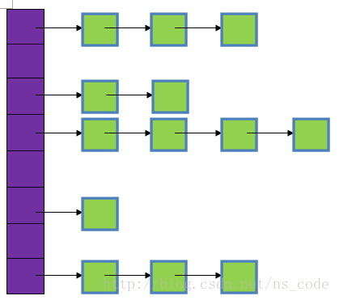

# 哈希表

> 包含集合和映射。即unordered_set和unordreed_map两种数据结构的实现方式。

> 参考文献
> * [https://www.cnblogs.com/gongcheng-/p/10894205.html#_label1_0](https://www.cnblogs.com/gongcheng-/p/10894205.html#_label1_0)

## 1 哈希表简介

### 哈希表的概念
* `哈希表`是一种使用`哈希函数`组织数据，以支持快速插入和搜索的数据结构。
* 通过选择合适的哈希函数，哈希表可以在插入和搜索方面实现`出色的性能`。

### 哈希表的分类
* 有两种不同类型的哈希表：哈希集合和哈希映射。
  - `哈希集合`是`集合set`数据结构的实现之一，用于存储`非重复值`。
  - `哈希映射`是`映射map` 数据结构的实现之一，用于存储`(key, value)`键值对。


## 2 哈希表的原理

### 原理说明
* 哈希表的关键思想是使用哈希函数将键映射到存储桶。更确切地说，
  1. 当我们插入一个新的键时，哈希函数将决定该键应该分配到哪个桶中，并将该键存储在相应的桶中；
  2. 当我们想要搜索一个键时，哈希表将使用相同的哈希函数来查找对应的桶，并只在特定的桶中进行搜索。

### 哈希函数


* 在示例中，我们使用 y = x ％ 5 作为哈希函数。让我们使用这个例子来完成插入和搜索策略：
   1. 插入：我们通过哈希函数解析键，将它们映射到相应的桶中。
      - 例如，1987 分配给桶 2，而 24 分配给桶 4。
   2. 搜索：我们通过相同的哈希函数解析键，并仅在特定存储桶中搜索。
      - 如果我们搜索 1987，我们将使用相同的哈希函数将 1987 映射到 2。因此我们在桶 2 中搜索，我们在那个桶中成功找到了 1987。
      - 例如，如果我们搜索 23，将映射 23 到 3，并在桶 3 中搜索。我们发现 23 不在桶 3 中，这意味着 23 不在哈希表中。

### 常用hash函数
* 

## 2.1 哈希表的关键——哈希函数

* 哈希函数是哈希表中最重要的组件，该哈希表用于将键映射到特定的桶。在上一节的示例中，我们使用 `y = x % 5` 作为散列函数，其中 `x` 是键值，`y` 是分配的桶的索引。

* 哈希函数将取决于`键值的范围`和`桶的数量。`

* 哈希函数的示例：


* 哈希函数的设计是一个开放的问题。其思想是尽可能将键分配到桶中，理想情况下，完美的哈希函数将是键和桶之间的一对一映射。然而，在大多数情况下，哈希函数并不完美，它需要在桶的数量和桶的容量之间进行权衡。

## 2.2 哈希表的关键——冲突解决

### 问题分析
* 理想情况下，如果我们的哈希函数是完美的一对一映射，我们将不需要处理冲突。不幸的是，在大多数情况下，冲突几乎是不可避免的。例如，在我们之前的哈希函数（_y = x ％ 5_）中，1987 和 2 都分配给了桶 2，这是一个`冲突`。


* 根据我们的哈希函数，这些问题与`桶的容量`和可能映射到`同一个桶`的`键的数目`有关。

* 让我们假设存储最大键数的桶有 `N` 个键。如果 N是常数且很小，我们可以简单地使用一个数组将键存储在同一个桶中。如果 N 是可变的或很大，我们可能需要使用`高度平衡的二叉树`来代替。

### 开放寻址法（open addressing）

* 这种方法也称再散列法，其基本思想是：当关键字key的哈希地址p=H（key）出现冲突时，以p为基础，产生另一个哈希地址p1，如果p1仍然冲突，再以p为基础，产生另一个哈希地址p2，…，直到找出一个不冲突的哈希地址pi ，将相应元素存入其中。这种方法有一个通用的再散列函数形式：

```
Hi=（H（key）+di）% m i=1，2，…，n
```

* 其中H（key）为哈希函数，m 为表长，di称为增量序列。增量序列的取值方式不同，相应的再散列方式也不同。

### 链接法

* 把散列到同一槽中的所有元素都存放在一个链表中。每个槽中有一个指针，指向所有散列到该槽的元素构成的链表的头。如果不存在这样的元素，则指针为空。如果链接法使用的是双向链表，那么删除操作的最坏情况运行时间与插入操作相同，都为O(1)，而平均情况下一次成功的查找需要Θ(1+α)时间。α是装填因子。

* 将散列表定义为一个由m个头指针组成的指针数 组T[0..m-1]。凡是散列地址为i的结点，均插入到以T[i]为头指针的单链表中。T中各分量的初值均应为空指针。在拉链法中，装填因子α可以大于 1，但一般均取α≤1。

* 优点：处理冲突简单，且无堆积现象，即非同义词决不会发生冲突，因此平均查找长度较短；由于拉链法中各链表上的结点空间是动态申请的，故它更适合于造表前无法确定表长的情况；开放定址法为减少冲突，要求装填因子α较小，故当结点规模较大时会浪费很多空间。而拉链法中可取α≥1，且结点较大时，拉链法中增加的指针域可忽略不计，因此节省空间；删除结点的操作易于实现。只要简单地删去链表上相应的结点即可

* 缺点：指针需要额外的空间，故当结点规模较小时，开放定址法较为节省空间，而若将节省的指

### 优缺点

* 开放散列表（open hashing）/拉链法（针对桶链结构）
  1. 优点：①对于记录总数频繁可变的情况，处理的比较好（也就是避免了动态调整的开销） ②由于记录存储在结点中，而结点是动态分配，不会造成内存的浪费，所以尤其适合那种记录本身尺寸（size）很大的情况，因为此时指针的开销可以忽略不计了 ③删除记录时，比较方便，直接通过指针操作即可
  2. 缺点： ①存储的记录是随机分布在内存中的，这样在查询记录时，相比结构紧凑的数据类型（比如数组），哈希表的跳转访问会带来额外的时间开销 ②如果所有的 key-value 对是可以提前预知，并之后不会发生变化时（即不允许插入和删除），可以人为创建一个不会产生冲突的完美哈希函数（perfect hash function），此时封闭散列的性能将远高于开放散列 ③由于使用指针，记录不容易进行序列化（serialize）操作
* 封闭散列（closed hashing）/ 开放定址法
  1. 优点： ①记录更容易进行序列化（serialize）操作 ②如果记录总数可以预知，可以创建完美哈希函数，此时处理数据的效率是非常高的
  2. 缺点： 
     1. 存储记录的数目不能超过桶数组的长度，如果超过就需要扩容，而扩容会导致某次操作的时间成本飙升，这在实时或者交互式应用中可能会是一个严重的缺陷 
     2. 使用探测序列，有可能其计算的时间成本过高，导致哈希表的处理性能降低 ③由于记录是存放在桶数组中的，而桶数组必然存在空槽，所以当记录本身尺寸（size）很大并且记录总数规模很大时，空槽占用的空间会导致明显的内存浪费 
     3. 删除记录时，比较麻烦。比如需要删除记录a，记录b是在a之后插入桶数组的，但是和记录a有冲突，是通过探测序列再次跳转找到的地址，所以如果直接删除a，a的位置变为空槽，而空槽是查询记录失败的终止条件，这样会导致记录b在a的位置重新插入数据前不可见，所以不能直接删除a，而是设置删除标记。这就需要额外的空间和操作。


## 3 哈希表的实现

### 自己设计哈希函数


### C++STL中的实现

* 哈希集合

```
#include<set>
set<int> s;
multiset<int> ms;
unordered_multiset<int> ums;
```
* 哈希映射

```
#include<map>
map<map> m;
multimap<map> mm;
unordered_multimap<map> umm;
```