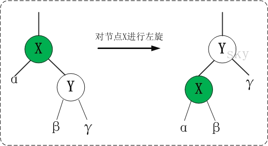

# 红黑树
> 树>二叉树>二叉搜索树>平衡二叉搜索树>红黑树（自平衡二叉搜索树）

> 参考文献
> * [红黑树](https://www.cnblogs.com/skywang12345/p/3245399.html#a1)
## 1 简介

### 定义
1. 满足二叉搜索树的定义。
2. 每个节点或者是黑色，或者是红色。
3. 根节点是黑色。每个叶子节点（NIL）是黑色。（这里叶子节点，是指为空NULL的叶子节点！）
4. 如果一个节点是红色的，则它的子节点必须是黑色的。
5. 从一个节点到该节点的子孙节点的所有路径上包含相同数目的黑节点。

### 优势
* 主要是用它来存储有序的数据，它的时间复杂度是O(lgn)，效率非常之高。

### 时间复杂度
* 红黑树的时间复杂度为: O(lgn)
## 2 操作
> 太过复杂，日后处理，根据参考文献。
### 基础操作

* 创建
* 遍历（同上）
* 插入
* 删除
* 旋转和着色

### 插入

* 第一步: 将红黑树当作一颗二叉查找树，将节点插入。
  * 红黑树本身就是一颗二叉查找树，将节点插入后，该树仍然是一颗二叉查找树。也就意味着，树的键值仍然是有序的。此外，无论是左旋还是右旋，若旋转之前这棵树是二叉查找树，旋转之后它一定还是二叉查找树。这也就意味着，任何的旋转和重新着色操作，都不会改变它仍然是一颗二叉查找树的事实。
  * 好吧？那接下来，我们就来想方设法的旋转以及重新着色，使这颗树重新成为红黑树！

* 第二步：将插入的节点着色为"红色"。
  * 为什么着色成红色，而不是黑色呢？为什么呢？
  * 将插入的节点着色为红色，不会违背"特性(5)"！少违背一条特性，就意味着我们需要处理的情况越少。接下来，就要努力的让这棵树满足其它性质即可；满足了的话，它就又是一颗红黑树了。o(∩∩)o...哈哈

* 第三步: 通过一系列的旋转或着色等操作，使之重新成为一颗红黑树。
    * 第二步中，将插入节点着色为"红色"之后，不会违背"特性(5)"。那它到底会违背哪些特性呢？
    * 对于"特性(1)"，显然不会违背了。因为我们已经将它涂成红色了。
    * 对于"特性(2)"，显然也不会违背。在第一步中，我们是将红黑树当作二叉查找树，然后执行的插入操作。而根据二叉查找数的特点，插入操作不会改变根节点。所以，根节点仍然是黑色。
    * 对于"特性(3)"，显然不会违背了。这里的叶子节点是指的空叶子节点，插入非空节点并不会对它们造成影响。
    * 对于"特性(4)"，是有可能违背的！
    * 那接下来，想办法使之"满足特性(4)"，就可以将树重新构造成红黑树了。

* 使用伪代码了解流程
```
RB-INSERT(T, z)  
    y ← nil[T]                        // 新建节点“y”，将y设为空节点。
    x ← root[T]                       // 设“红黑树T”的根节点为“x”
    while x ≠ nil[T]                  // 找出要插入的节点“z”在二叉树T中的位置“y”
        do y ← x                      
           if key[z] < key[x]  
              then x ← left[x]  
              else x ← right[x]  
    p[z] ← y                          // 设置 “z的父亲” 为 “y”
    if y = nil[T]                     
       then root[T] ← z               // 情况1：若y是空节点，则将z设为根
       else if key[z] < key[y]        
               then left[y] ← z       // 情况2：若“z所包含的值” < “y所包含的值”，则将z设为“y的左孩子”
               else right[y] ← z      // 情况3：(“z所包含的值” >= “y所包含的值”)将z设为“y的右孩子” 
    left[z] ← nil[T]                  // z的左孩子设为空
    right[z] ← nil[T]                 // z的右孩子设为空。至此，已经完成将“节点z插入到二叉树”中了。
    color[z] ← RED                    // 将z着色为“红色”
    RB-INSERT-FIXUP(T, z)             // 通过RB-INSERT-FIXUP对红黑树的节点进行颜色修改以及旋转，让树T仍然是一颗红黑树
```

* 使用改善伪代码
```
RB-INSERT-FIXUP(T, z)
    while color[p[z]] = RED                                                  // 若“当前节点(z)的父节点是红色”，则进行以下处理。
        do if p[z] = left[p[p[z]]]                                           // 若“z的父节点”是“z的祖父节点的左孩子”，则进行以下处理。
              then y ← right[p[p[z]]]                                        // 将y设置为“z的叔叔节点(z的祖父节点的右孩子)”
                   if color[y] = RED                                         // Case 1条件：叔叔是红色
                      then color[p[z]] ← BLACK                    ▹ Case 1   //  (01) 将“父节点”设为黑色。
                           color[y] ← BLACK                       ▹ Case 1   //  (02) 将“叔叔节点”设为黑色。
                           color[p[p[z]]] ← RED                   ▹ Case 1   //  (03) 将“祖父节点”设为“红色”。
                           z ← p[p[z]]                            ▹ Case 1   //  (04) 将“祖父节点”设为“当前节点”(红色节点)
                      else if z = right[p[z]]                                // Case 2条件：叔叔是黑色，且当前节点是右孩子
                              then z ← p[z]                       ▹ Case 2   //  (01) 将“父节点”作为“新的当前节点”。
                                   LEFT-ROTATE(T, z)              ▹ Case 2   //  (02) 以“新的当前节点”为支点进行左旋。
                              color[p[z]] ← BLACK                 ▹ Case 3   // Case 3条件：叔叔是黑色，且当前节点是左孩子。(01) 将“父节点”设为“黑色”。
                              color[p[p[z]]] ← RED                ▹ Case 3   //  (02) 将“祖父节点”设为“红色”。
                              RIGHT-ROTATE(T, p[p[z]])            ▹ Case 3   //  (03) 以“祖父节点”为支点进行右旋。
           else (same as then clause with "right" and "left" exchanged)      // 若“z的父节点”是“z的祖父节点的右孩子”，将上面的操作中“right”和“left”交换位置，然后依次执行。
    color[root[T]] ← BLACK 
```
* 根据被插入节点的父节点的情况，可以将"当节点z被着色为红色节点，并插入二叉树"划分为三种情况来处理。
    * 情况说明：被插入的节点是根节点。处理方法：直接把此节点涂为黑色。
    * 情况说明：被插入的节点的父节点是黑色。处理方法：什么也不需要做。节点被插入后，仍然是红黑树。
    * 情况说明：被插入的节点的父节点是红色。处理方法：那么，该情况与红黑树的“特性(4)”相冲突。这种情况下，被插入节点是一定存在非空祖父节点的；进一步的讲，被插入节点也一定存在叔叔节点(即使叔叔节点为空，我们也视之为存在，空节点本身就是黑色节点)。理解这点之后，我们依据"叔叔节点的情况"，将这种情况进一步划分为3种情况(Case)。
### 删除


## 3 旋转

### 左旋
* 失去平衡，逆时针旋转

```
LEFT-ROTATE(T, x)  
    y ← right[x]            // 前提：这里假设x的右孩子为y。下面开始正式操作
    right[x] ← left[y]      // 将 “y的左孩子” 设为 “x的右孩子”，即 将β设为x的右孩子
    p[left[y]] ← x          // 将 “x” 设为 “y的左孩子的父亲”，即 将β的父亲设为x
    p[y] ← p[x]             // 将 “x的父亲” 设为 “y的父亲”
    if p[x] = nil[T]       
    then root[T] ← y                 // 情况1：如果 “x的父亲” 是空节点，则将y设为根节点
    else if x = left[p[x]]  
              then left[p[x]] ← y    // 情况2：如果 x是它父节点的左孩子，则将y设为“x的父节点的左孩子”
              else right[p[x]] ← y   // 情况3：(x是它父节点的右孩子) 将y设为“x的父节点的右孩子”
    left[y] ← x             // 将 “x” 设为 “y的左孩子”
    p[x] ← y                // 将 “x的父节点” 设为 “y”
```

### 右旋

* 失去平衡，向右旋转


```
RIGHT-ROTATE(T, y)  
    x ← left[y]             // 前提：这里假设y的左孩子为x。下面开始正式操作
    left[y] ← right[x]      // 将 “x的右孩子” 设为 “y的左孩子”，即 将β设为y的左孩子
    p[right[x]] ← y         // 将 “y” 设为 “x的右孩子的父亲”，即 将β的父亲设为y
    p[x] ← p[y]             // 将 “y的父亲” 设为 “x的父亲”
    if p[y] = nil[T]       
    then root[T] ← x                 // 情况1：如果 “y的父亲” 是空节点，则将x设为根节点
    else if y = right[p[y]]  
              then right[p[y]] ← x   // 情况2：如果 y是它父节点的右孩子，则将x设为“y的父节点的左孩子”
              else left[p[y]] ← x    // 情况3：(y是它父节点的左孩子) 将x设为“y的父节点的左孩子”
    right[x] ← y            // 将 “y” 设为 “x的右孩子”
    p[y] ← x                // 将 “y的父节点” 设为 “x”
```

## 4 实现

```

```