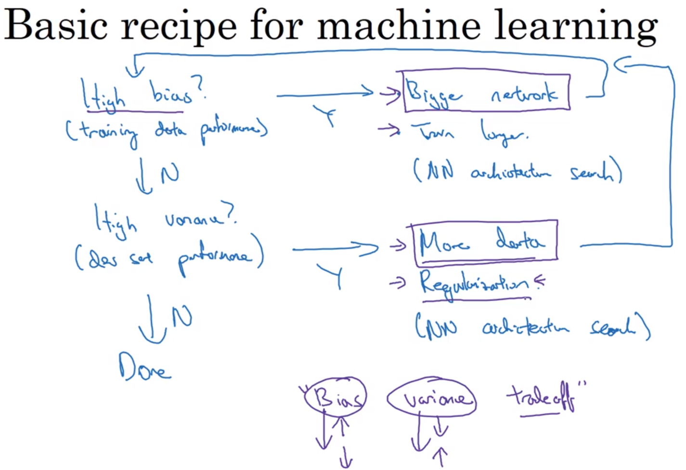
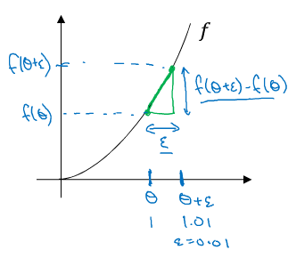
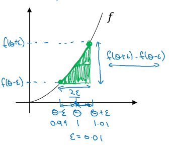

# 深度学习的实用层面

> * [笔记模板](https://github.com/bighuang624/Andrew-Ng-Deep-Learning-notes)
> * 相关的笔记都可以在github上先找到相关的笔记然后再修改，方便。


## 数据划分：训练 / 验证 / 测试集

* 应用深度学习是一个典型的迭代过程。
  * `->idea -> code -> employment->`

* 对于一个需要解决的问题的样本数据，在建立模型的过程中，数据会被划分为以下几个部分：
  * 训练集（train set）：用训练集对算法或模型进行**训练**过程；
  * 验证集（development set）：利用验证集（又称为简单交叉验证集，hold-out cross validation set）进行**交叉验证**，**选择出最好的模型**；
  * 测试集（test set）：最后利用测试集对模型进行测试，**获取模型运行的无偏估计**（对学习方法进行评估）。

* 在**小数据量**的时代，如 100、1000、10000 的数据量大小，可以将数据集按照以下比例进行划分：
    * 无验证集的情况：70% / 30%；
    * 有验证集的情况：60% / 20% / 20%；

* 而在如今的**大数据时代**，对于一个问题，我们拥有的数据集的规模可能是百万级别的，所以验证集和测试集所占的比重会趋向于变得更小。验证集的目的是为了验证不同的算法哪种更加有效，所以验证集只要足够大到能够验证大约 2-10 种算法哪种更好，而不需要使用 20% 的数据作为验证集。如百万数据中抽取 1 万的数据作为验证集就可以了。测试集的主要目的是评估模型的效果，如在单个分类器中，往往在百万级别的数据中，我们选择其中 1000 条数据足以评估单个模型的效果。
    * 100 万数据量：98% / 1% / 1%；
    * 超百万数据量：99.5% / 0.25% / 0.25%（或者99.5% / 0.4% / 0.1%）

### 建议

* 建议**验证集要和训练集来自于同一个分布**（数据来源一致），可以使得机器学习算法变得更快并获得更好的效果。如果不需要用**无偏估计**来评估模型的性能，则可以不需要测试集。

### 补充：交叉验证（cross validation）

* 交叉验证的基本思想是重复地使用数据；把给定的数据进行切分，将切分的数据集组合为训练集与测试集，在此基础上反复地进行训练、测试以及模型选择。

### 参考资料

* [无偏估计_百度百科](https://baike.baidu.com/item/%E6%97%A0%E5%81%8F%E4%BC%B0%E8%AE%A1/3370664?fr=aladdin)

## 模型估计：偏差 / 方差

### 偏差方差分解
* **“偏差-方差分解”（bias-variance decomposition）** 是解释学习算法泛化性能的一种重要工具。

* 泛化误差可分解为偏差、方差与噪声之和：
    * **偏差**：度量了学习算法的期望预测与真实结果的偏离程度，即刻画了**学习算法本身的拟合能力**；
    * **方差**：度量了同样大小的训练集的变动所导致的学习性能的变化，即刻画了**数据扰动所造成的影响**；
    * **噪声**：表达了在当前任务上任何学习算法所能够达到的期望泛化误差的下界，即刻画了**学习问题本身的难度**。

* 偏差-方差分解说明，**泛化性能**是由**学习算法的能力**、**数据的充分性**以及**学习任务本身的难度**所共同决定的。给定学习任务，为了取得好的泛化性能，则需要使偏差较小，即能够充分拟合数据，并且使方差较小，即使得数据扰动产生的影响小。

  * 在 **欠拟合（underfitting）** 的情况下，出现 **高偏差（high bias）** 的情况，即不能很好地对数据进行分类。

  * 当模型设置的太复杂时，训练集中的一些噪声没有被排除，使得模型出现 **过拟合（overfitting）** 的情况，在验证集上出现 **高方差（high variance）** 的现象。

* 当训练出一个模型以后，如果：

    * 训练集的错误率较小，而验证集的错误率却较大，说明模型存在较大方差，可能出现了过拟合；
    * 训练集和开发集的错误率都较大，且两者相当，说明模型存在较大偏差，可能出现了欠拟合；
    * 训练集错误率较大，且开发集的错误率远较训练集大，说明方差和偏差都较大，模型很差；
    * 训练集和开发集的错误率都较小，且两者的相差也较小，说明方差和偏差都较小，这个模型效果比较好。

* 偏差和方差的权衡问题对于模型来说十分重要。最优误差通常也称为“贝叶斯误差”。

### 应对方法

* 存在高偏差：

  * 扩大网络规模，如添加隐藏层或隐藏单元数目；
  * 寻找合适的网络架构，使用更大的 NN 结构；
  * 花费更长时间训练。

* 存在高方差：

    * 获取更多的数据；
    * 正则化（regularization）；
    * 寻找更合适的网络结构。



* 不断尝试，直到找到低偏差、低方差的框架。在深度学习的早期阶段，没有太多方法能做到只减少偏差或方差而不影响到另外一方。而在大数据时代，深度学习对监督式学习大有裨益，使得我们不用像以前一样太过关注如何平衡偏差和方差的权衡问题，通过以上方法可以在不增加某一方的前提下减少另一方的值。

## L2正则化（regularization）


### 正则化作用

* **正则化** 是在成本函数中加入一个正则化项，惩罚模型的复杂度。正则化可以用于解决高方差的问题。

### Logistic 回归中的正则化


* 对于 Logistic 回归，加入 L2 正则化（也称“L2 范数”）的成本函数：

$$J(w,b) = \frac{1}{m}\sum_{i=1}^mL(\hat{y}^{(i)},y^{(i)})+\frac{\lambda}{2m}{||w||}^2_2$$

* L2 正则化：
  $$\frac{\lambda}{2m}{||w||}^2_2 = \frac{\lambda}{2m}\sum_{j=1}^{n\_x}w^2_j = \frac{\lambda}{2m}w^Tw$$
* L1 正则化：
  $$\frac{\lambda}{2m}{||w||}_1 = \frac{\lambda}{2m}\sum_{j=1}^{n_x}{|w_j|}$$

* 其中，λ 为**正则化因子**，是**超参数**。由于 L1 正则化最后得到 w 向量中将存在大量的 0，使模型变得稀疏化，因此 L2 正则化更加常用。

* `lambda`在 Python 中属于保留字，所以在编程的时候，用`lambd`代替这里的正则化因子。

### 神经网络中的正则化

* 对于神经网络，加入正则化的成本函数：

$$J(w^{[1]}, b^{[1]}, ..., w^{[L]}, b^{[L]}) = \frac{1}{m}\sum_{i=1}^mL(\hat{y}^{(i)},y^{(i)})+\frac{\lambda}{2m}\sum_{l=1}^L{{||w^{[l]}||}}^2_F$$

* 因为 w 的大小为 ($n^{[l−1]}$, $n^{[l]}$)，因此

$${{||w^{[l]}||}}^2_F = \sum^{n^{[l-1]}}_{i=1}\sum^{n^{[l]}}_{j=1}(w^{[l]}_{ij})^2$$

* 该矩阵范数被称为**弗罗贝尼乌斯范数（Frobenius Norm）**，所以神经网络中的正则化项被称为弗罗贝尼乌斯范数矩阵。

### 权重衰减（Weight decay）

* **在加入正则化项后，梯度变为**（反向传播要按这个计算）：

$$dW^{[l]}= \frac{\partial L}{\partial w^{[l]}} +\frac{\lambda}{m}W^{[l]}$$

* 代入梯度更新公式：

$$W^{[l]} := W^{[l]}-\alpha dW^{[l]}$$

* 可得：

$$W^{[l]} := W^{[l]} - \alpha [\frac{\partial L}{\partial w^{[l]}} + \frac{\lambda}{m}W^{[l]}]$$

$$= W^{[l]} - \alpha \frac{\lambda}{m}W^{[l]} - \alpha \frac{\partial L}{\partial w^{[l]}}$$

$$= (1 - \frac{\alpha\lambda}{m})W^{[l]} - \alpha \frac{\partial L}{\partial w^{[l]}}$$

* 其中，因为 $1 - \frac{\alpha\lambda}{m}<1$，会给原来的 $W^{[l]}$一个衰减的参数，因此 L2 正则化项也被称为**权重衰减（Weight Decay）**。

### 正则化可以减小过拟合的原因

1. 直观解释：正则化因子设置的足够大的情况下，为了使成本函数最小化，权重矩阵 W 就会被设置为接近于 0 的值，**直观上**相当于消除了很多神经元的影响，那么大的神经网络就会变成一个较小的网络。当然，实际上隐藏层的神经元依然存在，但是其影响减弱了，便不会导致过拟合。

2. 数学解释：假设神经元中使用的激活函数为`g(z) = tanh(z)`（sigmoid 同理）。在加入正则化项后，当 λ 增大，导致 $W^{[l]}$减小，$Z^{[l]} = W^{[l]}a^{[l-1]} + b^{[l]}$便会减小。由上图可知，在 z 较小（接近于 0）的区域里，`tanh(z)`函数近似线性，所以每层的函数就近似线性函数，整个网络就成为一个简单的近似线性的网络，因此不会发生过拟合。


3. 其他解释在权值 $w^{[L]}$变小之下，输入样本 X 随机的变化不会对神经网络模造成过大的影响，神经网络受局部噪音的影响的可能性变小。这就是正则化能够降低模型方差的原因。

## dropout 正则化

### 概念

* **dropout（随机失活）** 是在神经网络的隐藏层为每个神经元结点设置一个随机消除的概率，保留下来的神经元形成一个结点较少、规模较小的网络用于训练。dropout 正则化较多地被使用在**计算机视觉（Computer Vision）**领域。


### 反向随机失活（Inverted dropout）

* 反向随机失活是实现 dropout 的方法。对第`l`层进行 dropout：

```py
keep_prob = 0.8    # 设置神经元保留概率
dl = np.random.rand(al.shape[0], al.shape[1]) < keep_prob # 产生一个true-false的矩阵，二维矩阵
al = np.multiply(al, dl)
al /= keep_prob
```

* 最后一步`al /= keep_prob`是因为 $a^{[l]}$中的一部分元素失活（相当于被归零），为了在下一层计算时不影响 $Z^{[l+1]} = W^{[l+1]}a^{[l]} + b^{[l+1]}$的期望值，因此除以一个`keep_prob`。

* **注意**，在**测试阶段不要使用 dropout**，因为那样会使得预测结果变得随机。

### 方差与噪声

* 引起方差的原因是噪声，即随机误差；偏差，不是随机误差，是模型误差。训练的本质过程，找到一组数据的相同点，排除这组数据的不同点（噪声、误差）
### 理解 dropout

* 对于单个神经元，其工作是接收输入并产生一些有意义的输出。但是加入了 dropout 后，输入的特征都存在被随机清除的可能，所以该神经元不会再特别依赖于任何一个输入特征，即不会给任何一个输入特征设置太大的权重。因此，通过传播过程，dropout 将产生和 L2 正则化相同的 **收缩权重** 的效果。

* 对于不同的层，设置的`keep_prob`也不同。一般来说，神经元较少的层，会设`keep_prob`为 1.0，而神经元多的层则会设置比较小的`keep_prob`。

* dropout 的一大 **缺点** 是成本函数无法被明确定义。因为每次迭代都会随机消除一些神经元结点的影响，因此无法确保成本函数单调递减。因此，使用 dropout 时，先将`keep_prob`全部设置为 1.0 后运行代码，确保 $J(w, b)$函数单调递减，再打开 dropout。

## 其他正则化方法

* 数据扩增（Data Augmentation）：通过图片的一些变换（翻转，局部放大后切割等），得到更多的训练集和验证集。
* 早停止法（Early Stopping）：将训练集和验证集进行梯度下降时的成本变化曲线画在同一个坐标轴内，当训练集误差降低但验证集误差升高，两者开始发生较大偏差时及时停止迭代，并返回具有最小验证集误差的连接权和阈值，以避免过拟合。这种方法的缺点是无法同时达成偏差和方差的最优。

## 标准化输入

* 使用标准化处理输入 X 能够有效加速收敛。采用了均值归一化的方法

### 标准化公式

$$x = \frac{x - \mu}{\sigma}$$


$$\mu = \frac{1}{m}\sum^m_{i=1}x^{(i)}$$

$$\sigma = \sqrt{\frac{1}{m}\sum^m_{i=1}x^{{(i)}^2}}$$


### 使用标准化的原因


* 有图可知，使用标准化前后，成本函数的形状有较大差别。在不使用标准化的成本函数中，如果设置一个较小的学习率，可能需要很多次迭代才能到达全局最优解；而如果使用了标准化，那么无论从哪个位置开始迭代，都能以相对较少的迭代次数找到全局最优解。

## 梯度消失和梯度爆炸

### 梯度消失和梯度爆炸

* 在梯度函数上出现的以指数级递增或者递减的情况分别称为**梯度爆炸**或者**梯度消失**。

* 假定 $g(z) = z, b^{[l]} = 0$，对于目标输出有：

$$\hat{y} = W^{[L]}W^{[L-1]}...W^{[2]}W^{[1]}X$$

* 对于 $W^{[l]}$的值大于 1 的情况，激活函数的值将以指数级递增；
* 对于 $W^{[l]}$的值小于 1 的情况，激活函数的值将以指数级递减。

* 对于导数同理。因此，在计算梯度时，根据不同情况梯度函数会以指数级递增或递减，导致训练导数难度上升，梯度下降算法的步长会变得非常小，需要训练的时间将会非常长。

### 利用初始化缓解梯度消失和爆炸

$$z={w}_1{x}_1+{w}_2{x}_2 + ... + {w}_n{x}_n + b$$

* 当输入的数量 n 较大时，我们希望每个 wi 的值都小一些，这样它们的和得到的 z 也较小。为了得到较小的 wi，设置`Var(wi)=1/n`，这里称为 **Xavier initialization**。

```py
WL = np.random.randn(WL.shape[0], WL.shape[1]) * np.sqrt(1/n)
```

* randn会生成标准正泰分布的样本，均值是0，方差是1。乘以$\sqrt{\frac{1}{n}}$，样本的方差会乘以$\frac{1}{n}$。其中 n 是某个神经元的输入神经元个数，即`WL.shape[1]`。

* 这样，激活函数的输入 x 近似设置成均值为 0，标准方差为 1，神经元输出 z 的方差就正则化到 1 了。虽然没有解决梯度消失和爆炸的问题，但其在一定程度上确实减缓了梯度消失和爆炸的速度。

* 同理，也有 **He Initialization**。它和  Xavier initialization 唯一的区别是`Var(wi)=2/n`，适用于 **ReLU** 作为激活函数时。当激活函数使用 ReLU 时，`Var(wi)=2/n`；当激活函数使用 tanh 时，`Var(wi)=1/n`。

## 梯度检验（Gradient checking）

### 梯度的数值逼近

* 使用双边误差的方法去逼近导数，精度要高于单边误差。

* 单边误差：



$$f'(\theta) = {\lim\_{\varepsilon\to 0}} = \frac{f(\theta + \varepsilon) - (\theta)}{\varepsilon}$$

* 误差：$O(\varepsilon)$

* 双边误差求导（即导数的定义）：



$$f'(\theta) = {\lim\_{\varepsilon\to 0}} = \frac{f(\theta + \varepsilon) - (\theta - \varepsilon)}{2\varepsilon}$$

* 误差：$O(\varepsilon^2)$

* 当 ε 越小时，结果越接近真实的导数，也就是梯度值。可以使用这种方法来判断反向传播进行梯度下降时，是否出现了错误。

## 梯度检验的实施

### 连接参数

* 将 $W^{[1]}$，$b^{[1]}$，...，$W^{[L]}$，$b^{[L]}$全部连接出来，成为一个巨型向量 θ。这样，

$$J(W^{[1]}, b^{[1]}, ..., W^{[L]}，b^{[L]}) = J(\theta)$$

* 同时，对 $dW^{[1]}$，$db^{[1]}$，...，$dW^{[L]}$，$db^{[L]}$执行同样的操作得到巨型向量 dθ，它和 θ 有同样的维度。


* 现在，我们需要找到 dθ 和代价函数 J 的梯度的关系。

### 进行梯度检验

* 求得一个梯度逼近值

$$d\theta_{approx}[i] ＝ \frac{J(\theta\_1, \theta\_2, ..., \theta\_i+\varepsilon, ...) - J(\theta\_1, \theta\_2, ..., \theta\_i-\varepsilon, ...)}{2\varepsilon}$$

$$\approx{d\theta[i]} = \frac{\partial J}{\partial \theta_i}$$

* 因此，我们用梯度检验值

$$\frac{{||d\theta_{approx} - d\theta||}_2}{{||d\theta_{approx}||}_2+{||d\theta||}_2}$$

* 检验反向传播的实施是否正确。其中，

$${||x||}_2 = \sum^N_{i=1}{|x_i|}^2$$

* 表示向量 x 的 2-范数（也称“欧几里德范数”）。如果梯度检验值和 ε 的值相近，说明神经网络的实施是正确的，否则要去检查代码是否存在 bug。

### 在神经网络实施梯度检验的实用技巧和注意事项

1. 不要在训练中使用梯度检验，它只用于调试（debug）。使用完毕关闭梯度检验的功能；
2. 如果算法的梯度检验失败，要检查所有项，并试着找出 bug，即确定哪个 dθapprox[i] 与 dθ 的值相差比较大；
3. 当成本函数包含正则项时，也需要带上正则项进行检验；
4. 梯度检验不能与 dropout 同时使用。因为每次迭代过程中，dropout 会随机消除隐藏层单元的不同子集，难以计算 dropout 在梯度下降上的成本函数 J。建议关闭 dropout，用梯度检验进行双重检查，确定在没有 dropout 的情况下算法正确，然后打开 dropout；

