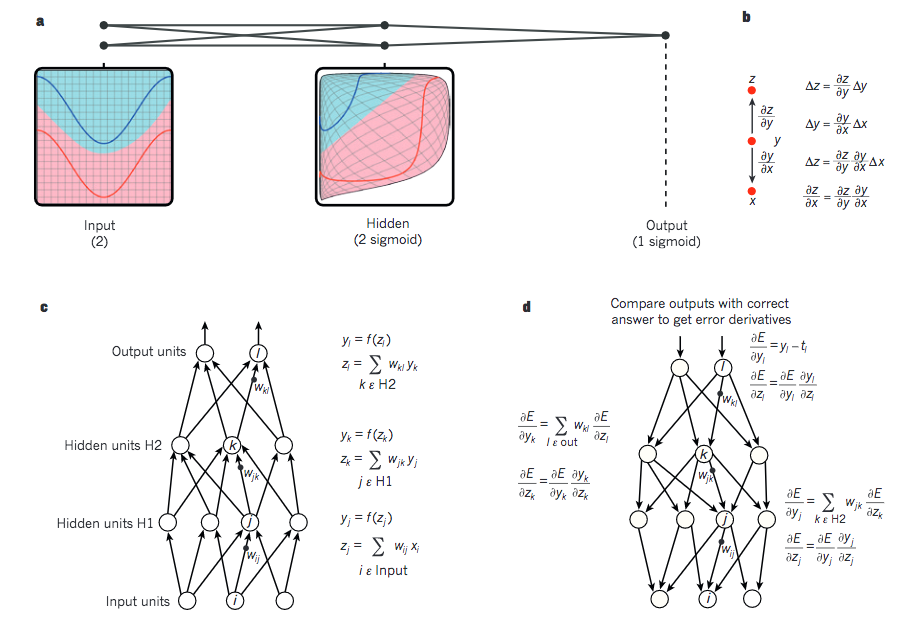

# 深层神经网络

## 深层神经网络的符号表示

* $L=4$,神经网络有四层。
* $n^{[l]}$,l层上单元的个数。
* $a^{[l]}$,l层上激活函数的输出，激活值。
* x表示输入的特征。
* $a^{[l]}g^{[l]}(z^{[l]})$l层的激活函数
* $z^{[l]}=W^{[l]T}a^{[l-1]}+b^{[l]}$,l层的求和
* 
## 深层网络中的前向和反向传播

### 前向传播

**输入**：$a^{[l−1]}$

**输出**：$a^{[l]}$，cache($z^{[l]}$)

**公式**：

$$Z^{[l]}=W^{[l]}\cdot a^{[l-1]}+b^{[l]}$$

$$a^{[l]}=g^{[l]}(Z^{[l]})$$

### 反向传播

**输入**：$da^{[l]}$

**输出**：$da^{[l-1]}$，$dW^{[l]}$，$db^{[l]}$

**公式**：

$$dZ^{[l]}=da^{[l]}*g^{[l]}{'}(Z^{[l]})$$

$$dW^{[l]}=dZ^{[l]}\cdot a^{[l-1]}$$

$$db^{[l]}=dZ^{[l]}$$

$$da^{[l-1]}=W^{[l]T}\cdot dZ^{[l]}$$

## 搭建深层神经网络块

* 神经网络的一步训练（一个梯度下降循环），包含了从 $a^{[0]}$（即 x）经过一系列正向传播计算得到 $\hat y$ （即 $a^{[l]}$）。然后再计算 $da^{[l]}$，开始实现反向传播，用**链式法则**得到所有的导数项，W 和 b 也会在每一层被更新。

* 在代码实现时，可以将正向传播过程中计算出来的 z 值缓存下来，待到反向传播计算时使用。

* 补充一张从 [Hinton、LeCun 和 Bengio 写的深度学习综述](NatureDeepReview.pdf)中摘下来的图，有助于理解整个过程：

## 矩阵的维度核对 

$$W^{[l]}: (n^{[l]}, n^{[l-1]})$$

$$b^{[l]}: (n^{[l]}, 1)$$

$$dW^{[l]}: (n^{[l]}, n^{[l-1]})$$

$$db^{[l]}: (n^{[l]}, 1)$$

对于 Z、a，向量化之前有：

$$Z^{[l]}, a^{[l]}: (n^{[l]}, 1)$$

而在向量化之后，则有：

$$Z^{[l]}, A^{[l]}: (n^{[l]}, m)$$

在计算反向传播时，dZ、dA 的维度和 Z、A 是一样的。

## 使用深层表示的原因

* 对于人脸识别，神经网络的第一层从原始图片中提取人脸的轮廓和边缘，每个神经元学习到不同边缘的信息；网络的第二层将第一层学得的边缘信息组合起来，形成人脸的一些局部的特征，例如眼睛、嘴巴等；后面的几层逐步将上一层的特征组合起来，形成人脸的模样。随着神经网络层数的增加，特征也从原来的边缘逐步扩展为人脸的整体，由整体到局部，由简单到复杂。层数越多，那么模型学习的效果也就越精确。

* 同样的，对于语音识别，第一层神经网络可以学习到语言发音的一些音调，后面更深层次的网络可以检测到基本的音素，再到单词信息，逐渐加深可以学到短语、句子。

* 通过例子可以看到，随着神经网络的深度加深，模型能学习到更加复杂的问题，功能也更加强大。

## 参数和超参数

* **参数**即是我们在过程中想要模型学习到的信息（**模型自己能计算出来的**），例如 $W^{[l]}$，$b^{[l]}$。属于模型本身的一部分。
* **超参数（hyper parameters）** 即为控制参数的输出值的一些网络信息（**需要人经验判断**）。超参数的改变会导致最终得到的参数 $W^{[l]}$，$b^{[l]}$ 的改变。超参数是训练过程相关的参数，用于训练模型的参数，不属于模型，属于训练过程。

典型的超参数有：

* 学习速率：α
* 迭代次数：N
* 隐藏层的层数：L
* 每一层的神经元个数：$n^{[1]}$，$n^{[2]}$，...
* 激活函数 g(z) 的选择

当开发新应用时，预先很难准确知道超参数的最优值应该是什么。因此，通常需要尝试很多不同的值。应用深度学习领域是一个很大程度基于经验的过程。
