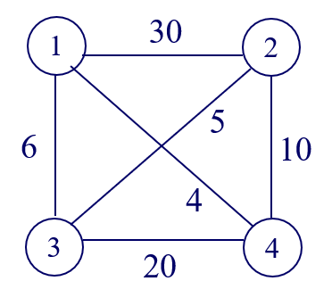
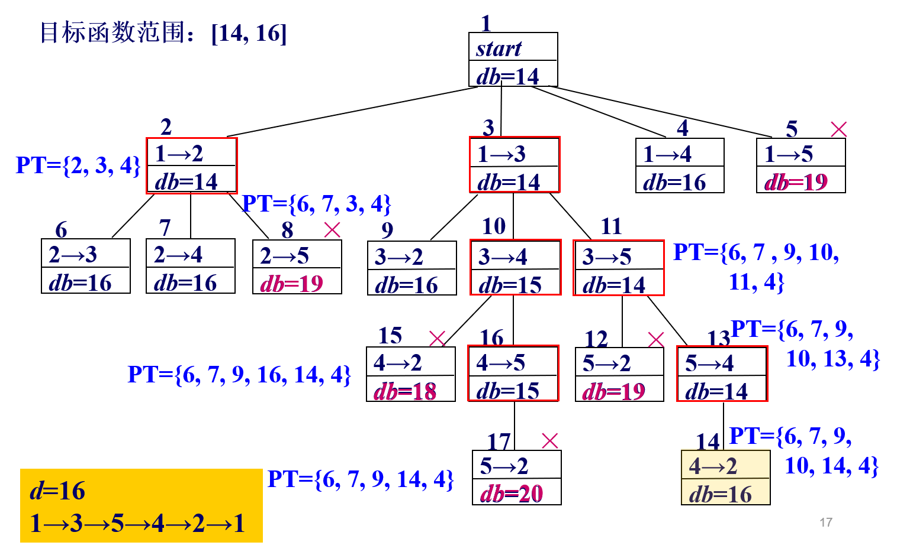

# 旅行商问题

## 1 旅行商问题-回溯法

### 问题描述
某售货员要到若干城市去推销商品，已知各城市间的路程耗费（代价），如何选定一条从驻地出发，经过每个城市一遍，最后回到驻地的路线，使得总路程耗费最小。


### 问题分析

* 解向量为<i1=1,i2,i3,…,in>，其中i2,i3,…,in为{2,3,…,n}的一个排列。搜索空间为排列树

* 显约束：
  * i=n时，检查是否存在一条从顶点x[n-1]到x[n]的边和一条从顶点x[n]到顶点1的边，若存在，需要判断当前回路代价是否优于已找到的当前最优回路代价bestc，若为真，更新当前最优值bestc和最优解bestx。
  * 当i<n时，当前扩展结点位于排列树的第i-1层。若图中存在从顶点x[i-1]到顶点x[i]的边，且x[1:i]的代价小于当前最优值bestc时，进入排列树的第i层，否则剪去相应子树。


### 算法时间复杂度

算法backtrack在最坏情况下可能需要更新当前最优解O((n-1)!)次，每次更新bestx需计算时间O(n)，从而整个算法的计算时间复杂性为O(n!)。

### 算法原理


### 算法实现

```
template<class Type>
void Traveling<Type>::Backtrack(int i){
   if (i == n) {
      if (a[x[n-1]][x[n]] != NoEdge && a[x[n]][1] != NoEdge &&
         (cc + a[x[n-1]][x[n]] + a[x[n]][1] < bestc || bestc == NoEdge)) {
         for (int j = 1; j <= n; j++) bestx[j] = x[j];
         bestc = cc + a[x[n-1]][x[n]] + a[x[n]][1];}
      }
   else {
      for (int j = i; j <= n; j++)
         // 是否可进入x[j]子树?
         if (a[x[i-1]][x[j]] != NoEdge &&
            (cc + a[x[i-1]][x[i]] < bestc || bestc == NoEdge)) {
            // 搜索子树
            Swap(x[i], x[j]);
            cc += a[x[i-1]][x[i]];
            Backtrack(i+1);
            cc -= a[x[i-1]][x[i]];
            Swap(x[i], x[j]);}
      }
}
```


## 2 旅行商问题-分支限界

### 问题描述

### 问题分析

* 问题上界：
   * 贪心法可求得问题近似解1→3 → 5 → 4 → 2 → 1，其路径长度为1+2+3+7+3=16，作为问题上界ub；

* 问题下界：
   * 图邻接矩阵每行最小元素相加，db=1+3+1+3+2=10；
   * 每个顶点应该有出入两条边，将邻接矩阵中每行最小两个元素相加在除以2，并向上取整，可得到更好下界，db=((1+3)+(3+6)+(1+2)+(3+4)+(2+3))/2=14；

### 算法原理

### 算法实现