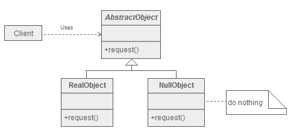

**索引**

-   意图

-   结构

-   参与者

-   适用性

-   效果

-   相关模式

-   实现

    -   实现方式（一）：Null Object 的示例实现。

**意图**

通过对缺失对象的封装，以提供默认无任何行为的对象替代品。

Encapsulate the absence of an object by providing a substitutable alternative
that offers suitable default do nothing behavior.

In short, a design where "nothing will come of nothing".

**结构**

**参与者**

AbstractObject

-   声明协作对象的接口。

-   如果需要，可以实现默认行为。

RealObject

-   具体的协作对象类，提供有意义的行为。

NullObject

-   空对象类，继承自 AbstractObject，但接口实现不做任何事情。

Client

-   请求协作对象。

**适用性**

当以下情况成立时可以使用 Null Object 模式：

-   一个对象需要一个协作对象，但并无具体的协作对象。

-   协作对象不需要做任何事情。

**效果**

-   减少了对对象是否为 Null 的判断。

-   提供默认无任何具体行为的协作对象。

**相关模式**

-   因为 Null Object 通常没有任何状态，所以多个实例可能都是类似的，可以使用
    [Singleton](http://www.cnblogs.com/gaochundong/p/design_pattern_singleton.html)
    模式来实现。

-   Null Object 看起来很像
    [Proxy](http://www.cnblogs.com/gaochundong/p/design_pattern_proxy.html)
    模式，但两者有着不同的目的。Proxy 提供对目标对象访问的控制，而 Null Object
    并不隐藏任何对象。

-   Null Object 可以作为
    [Strategy](http://www.cnblogs.com/gaochundong/p/design_pattern_strategy.html)
    模式中的一个特例。Strategy 提供多个具体类以区分算法，而 NullStrategy
    则可不做任何事情。

-   Null Object 可以作为
    [State](http://www.cnblogs.com/gaochundong/p/design_pattern_state.html)
    模式中的一个特例。使用 NullState 以便不做任何事情。

-   在
    [Visitor](http://www.cnblogs.com/gaochundong/p/design_pattern_visitor.html)
    模式中也可以使用 Null Object 以提供某种默认行为。

**实现**

**实现方式（一）：Null Object 的示例实现。**

复制代码

1 namespace NullObjectPattern.Implementation1 2 { 3 public interface ILog 4 { 5
void Write(string message); 6 } 7 8 public class ConsoleLog : ILog 9 { 10 public
void Write(string message) 11 { 12 Console.WriteLine(message); 13 } 14 } 15 16
public class NullLog : ILog 17 { 18 public void Write(string message) 19 { 20 //
do nothing21 } 22 } 23 24 public class Client 25 { 26 public void TestCase1() 27
{ 28 ILog log1 = new ConsoleLog(); 29 ILog log2 = new NullLog(); 30 31
log1.Write("message to log");32 log2.Write("message to log");33 } 34 } 35 }
